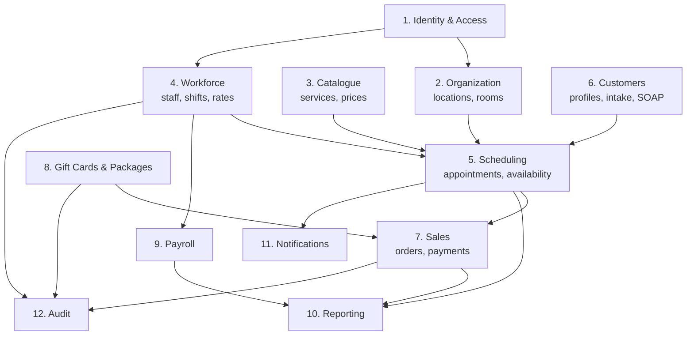
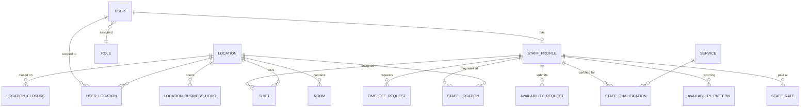
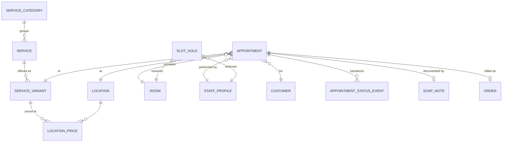
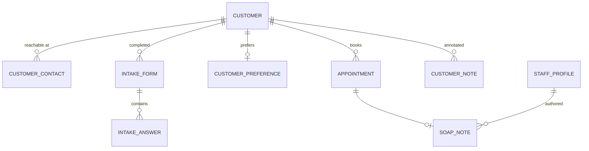
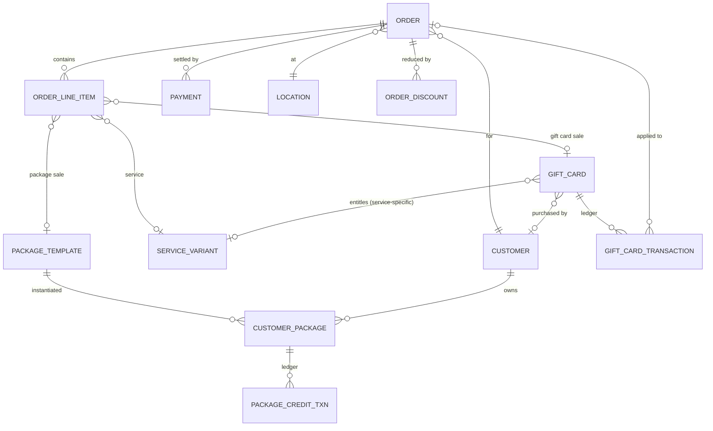
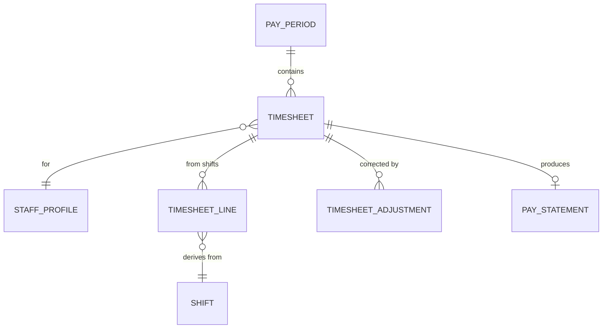

# Domain Model & Entity–Relationship Design

**Version:** 1.0 · Companion to `01-business-analysis.md`

---

## 1. Bounded Contexts

The system is a **modular monolith**. Ten modules, each owning its tables, exposing a service
interface, and never reaching into another module's tables directly.



**Dependency rule:** arrows point from provider to consumer. Scheduling depends on Organization,
Catalogue, Workforce and Customers. Nothing depends on Scheduling except Sales, Reporting and
Notifications. Reporting is read-only and may query across modules via views.

---

## 2. Entity–Relationship Diagram

### 2.1 Organization, Identity, Workforce



### 2.2 Catalogue & Scheduling



### 2.3 Customers



### 2.4 Sales, Payments, Gift Cards



### 2.5 Payroll



---

## 3. Entity Dictionary

### 3.1 Identity & Access

**`users`**
| Column | Type | Notes |
|---|---|---|
| id | bigint PK | |
| email | citext | unique, login identity |
| password_digest | string | bcrypt |
| first_name, last_name | string | |
| phone | string | |
| role | enum | `owner`, `manager`, `front_desk`, `therapist`, `customer_portal` |
| status | enum | `invited`, `active`, `suspended`, `disabled` |
| last_login_at | timestamptz | |
| failed_login_count | integer | lockout after N |
| discarded_at | timestamptz | soft delete |

> **Design note.** One `users` table with a role column, not STI. Roles here are coarse and a person
> never holds two simultaneously. A separate `permissions` table is over-engineering at this scale;
> a policy layer (Pundit) maps role + location scope to abilities.

**`user_locations`** — which locations a manager/front-desk user may access.
`(user_id, location_id)` unique. Owners bypass this check entirely.

### 3.2 Organization

**`locations`**
| Column | Type | Notes |
|---|---|---|
| id | bigint PK | |
| name, code | string | code unique, used in reports |
| address_line1/2, city, state, postal_code | string | |
| phone, email | string | |
| timezone | string | IANA, e.g. `America/New_York`. **Required.** |
| cancellation_window_hours | integer | default 24 |
| online_booking_enabled | boolean | |
| booking_lead_time_minutes | integer | default 120 |
| booking_horizon_days | integer | default 60 |
| status | enum | `active`, `inactive` |

**`rooms`**
| Column | Type | Notes |
|---|---|---|
| id | bigint PK | |
| location_id | FK | |
| name | string | unique per location |
| status | enum | `active`, `maintenance`, `retired` |
| position | integer | display order in the day view |

> Room *types* were explicitly excluded (1 booking = 1 room + 1 therapist, no capability matching).
> A nullable `room_type` column is nonetheless included in the migration plan as a forward hook —
> adding it later to a table with live appointments is far more painful than carrying an unused
> nullable column now.

**`room_blocks`** — time-bounded unavailability for a single room (deep clean, repair, private event).
`(room_id, starts_at, ends_at, during tstzrange GENERATED, reason, created_by_user_id)`.
Distinct from `rooms.status = 'maintenance'`, which takes a room out of service indefinitely.
Blocks participate in the availability search exactly like appointments.

**`location_business_hours`** — `(location_id, day_of_week 0–6, opens_at time, closes_at time)`.
Multiple rows per day permit split hours.

**`location_closures`** — `(location_id, date, reason)` for holidays.

### 3.3 Catalogue

**`services`** — `id, service_category_id, name, description, active, position`

**`service_variants`** — the bookable unit.
| Column | Type | Notes |
|---|---|---|
| id | bigint PK | |
| service_id | FK | |
| duration_minutes | integer | 30/60/90/120 |
| buffer_minutes | integer | room turnover, default 15 |
| base_price_cents | integer | company default |
| active | boolean | |

**`location_prices`** — effective-dated per-location override.
`(location_id, service_variant_id, price_cents, effective_from date, effective_to date NULL)`

> **Price resolution order:** location price effective on the booking date → `base_price_cents`.
> Resolved once at booking and snapshotted (BR-09).

**`staff_qualifications`** — `(staff_profile_id, service_id, certified_on, active)`.
Qualification is at **service** level, not variant — a therapist certified in Deep Tissue can do all
its durations.

### 3.4 Workforce

**`staff_profiles`**
| Column | Type | Notes |
|---|---|---|
| id | bigint PK | |
| user_id | FK unique | |
| employee_code | string | unique |
| employment_type | enum | `employee`, `contractor` |
| hire_date | date | |
| termination_date | date NULL | |
| status | enum | `onboarding`, `active`, `on_leave`, `terminated` |
| bio, photo_url | text/string | shown in online booking |
| display_name | string | first name only for customer-facing views |

**`staff_locations`** — `(staff_profile_id, location_id, is_home)` — many-to-many, confirmed.

**`staff_rates`** — **effective-dated. Never updated in place.**
| Column | Type | Notes |
|---|---|---|
| staff_profile_id | FK | |
| hourly_rate_cents | integer | |
| effective_from | date | |
| effective_to | date NULL | NULL = current |
| created_by_user_id | FK | audit |
| note | text | reason for change |

> Constraint: no overlapping `[effective_from, effective_to]` ranges per staff. Enforced with a
> Postgres `EXCLUDE` constraint on `daterange`. This is what makes BR-24 true by construction.

**`availability_patterns`** — recurring weekly template.
`(staff_profile_id, day_of_week, start_time, end_time, preferred_location_id NULL,
effective_from, effective_to NULL, active)`

**`availability_requests`** — one-off submissions.
`(staff_profile_id, date, start_time, end_time, preferred_location_id NULL,
status enum{submitted,approved,rejected,withdrawn}, reviewed_by_user_id, reviewed_at, note)`

**`shifts`** — **the authoritative scheduling and payroll record.**
| Column | Type | Notes |
|---|---|---|
| id | bigint PK | |
| staff_profile_id | FK | |
| location_id | FK | |
| starts_at, ends_at | timestamptz | |
| during | tstzrange GENERATED | `tstzrange(starts_at, ends_at, '[)')` — used by the exclusion constraint |
| status | enum | `draft`, `published`, `cancelled` |
| source | enum | `manual`, `pattern`, `request` |
| availability_pattern_id | FK NULL | provenance |
| break_starts_at, break_ends_at | timestamptz NULL | positioned break — blocks booking during it |
| break_minutes | integer | unpaid break deducted from payroll hours (derived from the break window when set) |
| locked | boolean | true once the pay period closes |

> The break is stored as an **interval, not just a duration**, because it must do two jobs: subtract
> from payable hours *and* remove the therapist from availability during lunch. A scalar minute
> count cannot do the second.

> **Critical constraint (BR-04):**
> `EXCLUDE USING gist (staff_profile_id WITH =, during WITH &&) WHERE (status = 'published')`
> Company-wide, because staff work at any location.

**`time_off_requests`** — `(staff_profile_id, starts_on, ends_on, kind enum{vacation,sick,unpaid,other}, status, reviewed_by, note)`

### 3.5 Scheduling

**`appointments`**
| Column | Type | Notes |
|---|---|---|
| id | bigint PK | |
| reference | string | human-friendly, e.g. `APT-2026-084213` |
| customer_id | FK | |
| location_id | FK | |
| room_id | FK | |
| staff_profile_id | FK | |
| service_variant_id | FK | |
| starts_at, ends_at | timestamptz | `ends_at = starts_at + duration + buffer` |
| service_ends_at | timestamptz | end of the massage itself, excluding buffer |
| during | tstzrange GENERATED | for exclusion constraints |
| status | enum | `scheduled, checked_in, in_progress, completed, cancelled, late_cancelled, no_show` |
| price_cents | integer | **snapshot** (BR-09) |
| booking_channel | enum | `phone, walk_in, online, staff, manager` |
| created_by_user_id | FK NULL | null for online self-service |
| customer_note | text | requests from the customer |
| internal_note | text | staff-only |
| cancelled_at, cancellation_reason | | |
| rescheduled_from_id | FK NULL | reschedule chain |

> **Two exclusion constraints, both partial on active statuses**
> (`scheduled, checked_in, in_progress, completed`):
> - `EXCLUDE USING gist (room_id WITH =, during WITH &&)` — BR-08
> - `EXCLUDE USING gist (staff_profile_id WITH =, during WITH &&)` — BR-07
>
> These make double-booking **impossible at the storage layer**, independent of application logic,
> race conditions, or a buggy front end. Everything else in the scheduling module is an optimisation
> on top of this guarantee.

**`appointment_status_events`** — append-only transition log.
`(appointment_id, from_status, to_status, actor_user_id, occurred_at, reason)`

**`slot_holds`** — transient reservations during online checkout.
`(room_id, staff_profile_id, during tstzrange, session_token, expires_at)` — swept by a job.
Participates in the same exclusion checks as appointments via the availability query.

### 3.6 Customers

**`customers`**
| Column | Type | Notes |
|---|---|---|
| id | bigint PK | |
| user_id | FK NULL | set only if they have a portal login |
| first_name, last_name | string | |
| email | citext | indexed, not necessarily unique (couples share) |
| phone | string | **primary search key** — normalise to E.164 |
| date_of_birth | date NULL | birthday campaigns |
| gender | string NULL | free text / optional |
| preferred_location_id | FK NULL | |
| marketing_opt_in | boolean | |
| no_show_count, late_cancel_count | integer | denormalised counters (BR-13) |
| first_visit_at, last_visit_at | timestamptz | maintained aggregates |
| lifetime_value_cents | integer | maintained aggregate |
| status | enum | `active`, `blocked`, `merged` |
| merged_into_customer_id | FK NULL | duplicate resolution |
| discarded_at | timestamptz | soft delete |

> **Duplicate customers are inevitable** with phone bookings. Ship a merge tool in v1: merging
> repoints appointments/orders and sets `merged_into_customer_id`, never deletes.

**`customer_preferences`** — `(customer_id, preferred_staff_profile_id, pressure enum, room_temperature, music, aromatherapy, notes)`

**`intake_forms`** — **encrypted health data.**
`(customer_id, version, submitted_at, signature_data, signed_by_name, ip_address, locale)`

**`intake_answers`** — `(intake_form_id, question_key, answer_value ENCRYPTED, answer_type)`

> Answers stored as encrypted key/value rather than fixed columns so the questionnaire can evolve
> without migrations, and so a version bump doesn't invalidate old submissions.

**`soap_notes`** — **append-only clinical record (BR-16).**
| Column | Type | Notes |
|---|---|---|
| appointment_id | FK | |
| staff_profile_id | FK | author |
| subjective, objective, assessment, plan | text ENCRYPTED | |
| areas_worked | jsonb | structured body-map data |
| pressure_used | string | |
| supersedes_note_id | FK NULL | corrections chain to the original |
| created_at | timestamptz | no `updated_at` — rows are never modified |

**`customer_notes`** — non-clinical front-desk notes, separately permissioned from SOAP.

### 3.7 Sales & Payments

**`orders`**
| Column | Type | Notes |
|---|---|---|
| id | bigint PK | |
| number | string unique | receipt number |
| customer_id | FK NULL | walk-in gift card purchase may be anonymous |
| location_id | FK | |
| appointment_id | FK NULL | null for standalone gift card / package sales |
| subtotal_cents, discount_cents, tax_cents, tip_cents, total_cents | integer | |
| status | enum | `open`, `paid`, `voided`, `refunded` |
| opened_by_user_id, closed_by_user_id | FK | |
| closed_at | timestamptz | |

**`order_line_items`** — polymorphic on `purchasable`.
`(order_id, purchasable_type, purchasable_id, description, quantity, unit_price_cents, line_total_cents, staff_profile_id NULL)`
`purchasable_type ∈ {ServiceVariant, GiftCard, PackageTemplate}`.
`staff_profile_id` on the line attributes the sale to the performing therapist.

> **BR-19 lives here.** A `GiftCard` line item posts to a **liability** account, not revenue. The
> reporting layer must classify line items by `purchasable_type`, never sum `orders.total_cents` as
> revenue.

**`payments`** — **immutable (BR-17).**
| Column | Type | Notes |
|---|---|---|
| order_id | FK | |
| method | enum | `cash`, `card`, `zelle`, `online` |
| amount_cents | integer | |
| reference | string | last-4, Zelle confirmation ID, transfer note |
| received_at | timestamptz | |
| received_by_user_id | FK | |
| status | enum | `captured`, `voided` |
| voided_by_user_id, voided_at, void_reason | | |

> Gift card redemptions are **not** payments — they live in `gift_card_transactions` and are joined
> into the settlement calculation. Keeping them separate is what allows the liability to be tracked
> correctly.

**`order_discounts`** — `(order_id, kind enum{manual,promo_code,package}, code, amount_cents, applied_by_user_id, reason)`

### 3.8 Gift Cards & Packages

**`gift_cards`**
| Column | Type | Notes |
|---|---|---|
| id | bigint PK | |
| code | string unique | printed on the card; generate collision-resistant, non-sequential |
| card_type | enum | `stored_value`, `fixed_denomination`, `service_specific` |
| initial_value_cents | integer | |
| current_balance_cents | integer | **cache** of the ledger (BR-18) |
| service_variant_id | FK NULL | required when `service_specific` |
| purchaser_customer_id | FK NULL | |
| recipient_name, recipient_email | string NULL | |
| issued_at, expires_at | timestamptz | |
| issued_at_location_id | FK | |
| status | enum | `issued`, `active`, `depleted`, `expired`, `void` |

**`gift_card_transactions`** — **the source of truth (BR-18).**
`(gift_card_id, kind enum{issue,redeem,refund,adjust,expire}, amount_cents signed,
balance_after_cents, order_id NULL, appointment_id NULL, redeemed_by_customer_id NULL,
performed_by_user_id, location_id, occurred_at, note)`

> `balance_after_cents` is written on insert inside the same transaction that takes a row lock on
> the card. That gives a self-verifying ledger: a nightly job asserts
> `sum(amount_cents) == current_balance_cents` for every card and alerts on drift.

**`package_templates`** — `(name, service_variant_id NULL, credit_count, price_cents, validity_days, active)`

**`customer_packages`** — `(customer_id, package_template_id, purchased_order_id, credits_total, credits_remaining, expires_at, status)`

**`package_credit_transactions`** — same ledger pattern as gift cards.

### 3.9 Payroll

**`pay_periods`** — `(starts_on, ends_on, status enum{open,in_review,locked}, locked_at, locked_by_user_id)`

**`timesheets`** — `(pay_period_id, staff_profile_id, scheduled_minutes, adjustment_minutes, payable_minutes, status)`

**`timesheet_lines`** — `(timesheet_id, shift_id, work_date, minutes, hourly_rate_cents, amount_cents)`

> The **rate is snapshotted onto each line** at generation time, resolved from `staff_rates` by
> `work_date`. This is what makes BR-24 hold even if someone later edits rate history.

**`timesheet_adjustments`** — `(timesheet_id, work_date, minutes signed, reason, created_by_user_id)`

**`pay_statements`** — `(timesheet_id, total_hours, gross_amount_cents, generated_at, approved_by_user_id, document_url)`

### 3.10 Cross-cutting

**`audit_logs`** — `(auditable_type, auditable_id, action, actor_user_id, actor_role, changes jsonb, ip_address, occurred_at)`
Written for every change to rates, payments, gift cards, appointment status, pay periods, and every
**read** of intake forms and SOAP notes.

**`notifications`** — `(recipient_type, recipient_id, channel, template_key, payload jsonb, scheduled_for, sent_at, status, error)`

---

## 4. Key Invariants (enforce in the database, not only in Ruby)

| # | Invariant | Mechanism |
|---|---|---|
| 1 | No two active appointments share a room in overlapping time | `EXCLUDE USING gist` on `(room_id, during)` |
| 2 | No two active appointments share a therapist in overlapping time | `EXCLUDE USING gist` on `(staff_profile_id, during)` |
| 3 | No two published shifts overlap for one therapist | `EXCLUDE USING gist` on `(staff_profile_id, during)` |
| 4 | Staff rate periods never overlap | `EXCLUDE USING gist` on `(staff_profile_id, daterange)` |
| 5 | Location price periods never overlap per variant | `EXCLUDE USING gist` |
| 6 | Gift card balance never negative | `CHECK (current_balance_cents >= 0)` + ledger row lock |
| 7 | Order total = subtotal − discount + tax + tip | `CHECK` constraint |
| 8 | Payments never exceed order total | application-level, inside a serialisable transaction |
| 9 | Appointment room and staff belong to `appointment.location_id` | trigger or model validation + FK composite |
| 10 | `ends_at > starts_at` everywhere | `CHECK` constraints |
| 11 | A service-specific gift card has `service_variant_id NOT NULL` | `CHECK` on card_type |
| 12 | Terminated staff have no future published shifts | application guard at offboarding (BR-02) |

Requires the `btree_gist` extension: `CREATE EXTENSION IF NOT EXISTS btree_gist;`

---

## 5. Money, Time and Identity Conventions

- **Money:** integer `_cents` columns everywhere. No `decimal`, no `float`. One currency (USD) in
  v1; a `currency` column is deliberately omitted — adding it later is a mechanical migration,
  whereas float rounding errors are unrecoverable.
- **Time:** all timestamps `timestamptz` (stored UTC). Business-hour columns are naked `time`
  interpreted in the **location's** timezone. Never store local time in a `timestamp` column.
- **Durations:** integer minutes, never intervals.
- **Public identifiers:** appointments, orders, and gift cards carry a human-readable `reference` /
  `number` / `code` separate from the numeric PK. Never expose sequential PKs in URLs or on
  printed cards.
- **Soft delete:** `discarded_at` on customers, staff, and users. Catalogue entities use
  `active: false`. Financial and clinical records are never deleted.

---

## 6. Indexing Plan (initial)

```sql
-- Availability search: the hottest path
CREATE INDEX idx_appt_loc_time     ON appointments (location_id, starts_at)
  WHERE status IN ('scheduled','checked_in','in_progress','completed');
CREATE INDEX idx_appt_staff_time   ON appointments (staff_profile_id, starts_at);
CREATE INDEX idx_appt_room_time    ON appointments (room_id, starts_at);
CREATE INDEX idx_shift_loc_time    ON shifts (location_id, starts_at) WHERE status = 'published';
CREATE INDEX idx_shift_staff_time  ON shifts (staff_profile_id, starts_at) WHERE status = 'published';

-- Front desk customer lookup
CREATE INDEX idx_cust_phone        ON customers (phone);
CREATE INDEX idx_cust_email        ON customers (email);
CREATE INDEX idx_cust_name_trgm    ON customers USING gin ((first_name || ' ' || last_name) gin_trgm_ops);

-- Reporting
CREATE INDEX idx_appt_cust_time    ON appointments (customer_id, starts_at DESC);
CREATE INDEX idx_payment_received  ON payments (received_at, method) WHERE status = 'captured';
CREATE INDEX idx_gct_card_time     ON gift_card_transactions (gift_card_id, occurred_at);
CREATE UNIQUE INDEX idx_gc_code    ON gift_cards (code);
```
