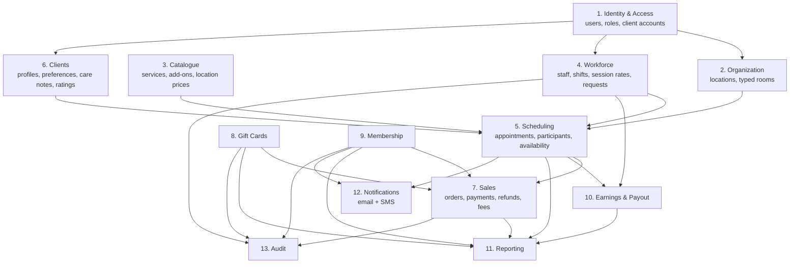
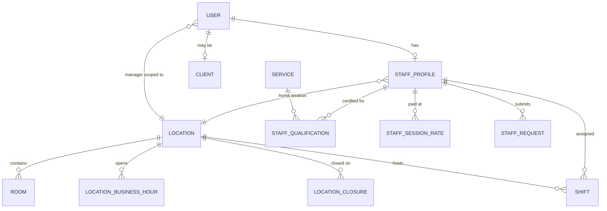
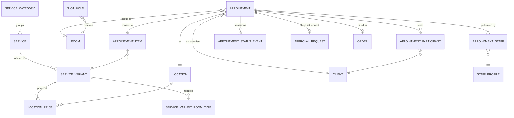
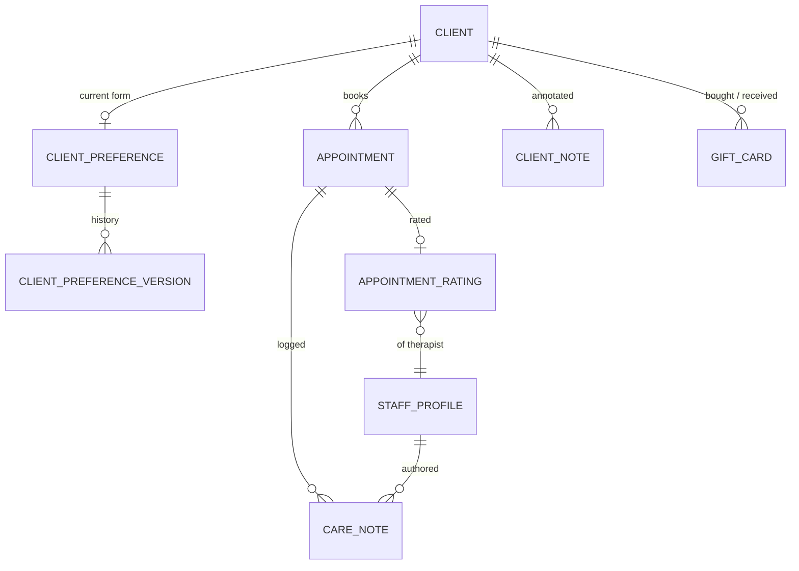
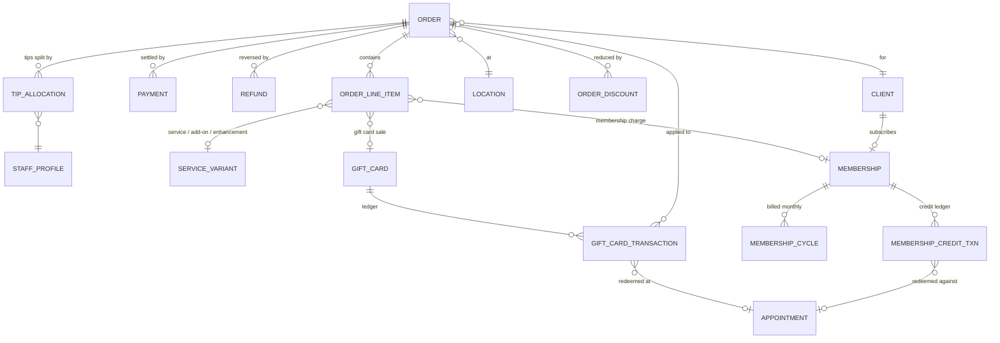
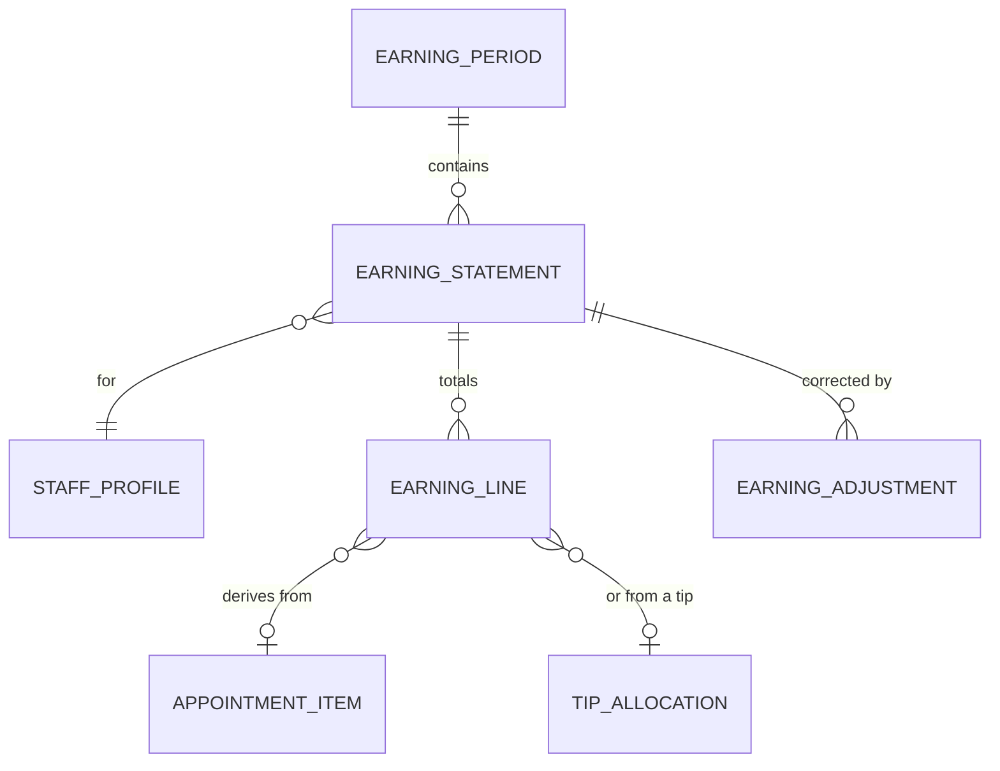

# Domain Model & Entity–Relationship Design

**Version:** 1.0 · Companion to `01-business-analysis.md` · Aligned to FRS v7

> **Delivery posture.** The schema below is complete and is built in full in Release 1, including
> the columns and tables that only Release 2 exercises. Carrying an unused nullable column costs
> nothing; adding one to a table with live appointments and live money in it is painful. Columns
> that lie dormant until Release 2 are marked as such.

---

## 1. Bounded Contexts

A **modular monolith**. Each module owns its tables, exposes a service interface, and never reaches
into another module's tables directly.



**Dependency rule:** arrows point from provider to consumer. Scheduling depends on Organization,
Catalogue, Workforce and Clients. Nothing depends on Scheduling except Sales, Earnings, Reporting
and Notifications. Reporting is read-only and may query across modules through views.

---

## 2. Entity–Relationship Diagrams

### 2.1 Organization, Identity, Workforce



### 2.2 Catalogue & Scheduling



### 2.3 Clients



### 2.4 Sales, Payments, Gift Cards, Membership



### 2.5 Earnings & Payout



---

## 3. Entity Dictionary

### 3.1 Identity & Access

**`users`**
| Column | Type | Notes |
|---|---|---|
| id | bigint PK | |
| email | citext | unique where present |
| phone | string | E.164; **primary identity for clients** |
| password_digest | string NULL | bcrypt; null for OTP-only client accounts *(Release 2)* |
| first_name, last_name | string | |
| role | enum | `owner`, `manager`, `staff`, `client` |
| location_id | FK NULL | **required for `manager`** — the single location they are scoped to |
| status | enum | `invited`, `active`, `suspended`, `disabled` |
| last_login_at | timestamptz | |
| failed_login_count | integer | lockout after N |
| sms_consent_at, email_consent_at | timestamptz NULL | RISK-03 |
| discarded_at | timestamptz | soft delete |

> **Design note.** There is no separate front-desk role — FRS §16 states Manager and front desk
> are the same role. Manager scoping is a single `location_id` column rather than a join table,
> because a manager belongs to exactly one location and cannot switch. Owner ignores the column.

**Client authentication** *(Release 2)*. No client logs in during Release 1 — the `client` role
exists in the enum but is never issued. FRS §22 leaves the mechanism to us. Chosen for Release 2:
**phone + SMS one-time code** as the primary path, with optional email/password. Rationale — the phone number is already
the client's identity everywhere else in the business, it removes a password to forget and reset,
and the SMS channel is already being paid for (confirmations, reminders, fee notices, rating links).

### 3.2 Organization

**`locations`** — exactly four rows, seeded.
| Column | Type | Notes |
|---|---|---|
| id | bigint PK | |
| name, code | string | `lawrence`, `skokie`, `luma`, `belmont` |
| address_line1/2, city, state, postal_code | string | |
| phone, email | string | |
| timezone | string | IANA. All four are `America/Chicago`. **Not nullable, no default.** |
| opens_at, closes_at | time | 09:00 / 22:00 default (FRS §6) |
| slot_granularity_minutes | integer | default 15 |
| buffer_minutes | integer | default 15 (FRS §21) |
| booking_horizon_days | integer | default 183 (~6 months) |
| booking_cutoff_minutes | integer | default 60; Owner sets 15/30/60 (FRS §5.1). *Release 2 — the client channel is the only one it constrains* |
| cancellation_window_hours | integer | default 4 (FRS §21) |
| late_cancel_fee_percent | integer | default 20 |
| no_show_fee_percent | integer | default 20 |
| deposit_percent | integer | default 20 *(Release 2)* |
| reminder_offsets_minutes | integer[] | default `{1440, 120}` — 24 h and 2 h before start |
| low_rating_alert_at_or_below | integer | default 6 on the 1–10 scale; alerts Owner + Manager (BR-45a) |
| gift_card_expiry_months | integer | default 12; flags the card, never forfeits the balance (BR-30) |
| online_booking_enabled | boolean | *(Release 2)* |
| status | enum | `active`, `inactive` |

> Fee, deposit and window values are **per-location columns, not constants**, even though FRS v7
> gives one number for all four. A policy expressed as a config row is changed by the Owner; a
> policy expressed as a constant is changed by a deploy.

**`rooms`**
| Column | Type | Notes |
|---|---|---|
| id | bigint PK | |
| location_id | FK | |
| name | string | unique per location |
| room_type | enum | `single`, `couple`, `three_table`, `head_spa` |
| client_capacity | integer | **how many clients the room seats**: 1 single, 2 couple, 3 three_table, 2 head_spa |
| exclusive | boolean | true only for `head_spa` — the room accepts *only* services that require its type |
| status | enum | `active`, `maintenance`, `retired` |
| position | integer | row order in the day board |

Seeded from FRS §20:

| Location | single | couple | three_table | head_spa | Total |
|---|--:|--:|--:|--:|--:|
| Skokie | 3 | 3 | 1 | 0 | 7 |
| Lawrence | 4 | 4 | 0 | 0 | 8 |
| Luma | 3 | 3 | 0 | 2 | 8 |
| Belmont | 2 | 4 | 0 | 0 | 6 |

> **Matching is by capacity, not by type equality.** The Skokie three-table
> room takes a 3-person booking, a couple, or a single, so a rule of "room_type must equal the
> required type" would strand it. A room qualifies when
> `room.client_capacity >= variant.required_client_capacity`, and — because a head-spa room is
> specialised equipment rather than spare floor space — a room marked `exclusive` additionally
> requires `variant.requires_room_type = room.room_type`.
>
> The consequence is that a single massage *can* occupy a couple room when the singles are full,
> which is what the front desk would do anyway. The engine's assignment policy then takes the
> **smallest sufficient room** (BR-09a) so this only happens under pressure. FRS §20 also states
> that facial-and-body combinations run in a **single** room, so a combination needs capacity 1,
> not two rooms.

**`room_blocks`** — time-bounded unavailability for one room (deep clean, repair, private event).
`(room_id, starts_at, ends_at, during tstzrange GENERATED, reason, created_by_user_id)`.
Distinct from `rooms.status = 'maintenance'`, which takes a room out of service indefinitely.
Blocks participate in the availability search exactly like appointments.

**`location_business_hours`** — `(location_id, day_of_week 0–6, opens_at, closes_at)`. Multiple
rows per day permit split hours.

**`location_closures`** — `(location_id, date, reason)` for holidays.

### 3.3 Catalogue

**`service_categories`** — `massage`, `facial`, `head_spa`, `bioelectric`, `add_on`, `enhancement`.

**`services`** — `id, service_category_id, name, description, kind, active, position`

`kind` enum: `standard` (a bookable service), `add_on` (a 30-minute extra on the same appointment,
same therapist), `enhancement` (price only, no duration, no pay).

Enhancements in the catalogue: essential oil **$10** (FRS §19.11), and hot stone, hot herbal
compression and aromatherapy at **$15 each**. None of the four adds time —
they are delivered inside the booked session length, so they never affect the appointment interval
or the pay ladder. All three $15 enhancements are **free when applied to a membership's included
60-minute massage** (FRS §23).

**`service_variants`** — the bookable unit.
| Column | Type | Notes |
|---|---|---|
| id | bigint PK | |
| service_id | FK | |
| duration_minutes | integer | 0 for enhancements; 30/45/60/75/90/120 otherwise |
| therapist_count | integer | **1 or 2.** 2 for couples massage, four hands, couple head spa |
| required_client_capacity | integer | 1, or 2 for couples services. Matched against `rooms.client_capacity` |
| requires_room_type | enum NULL | non-null only for head spa and bioelectric — forces an `exclusive` room |
| base_price_cents | integer | company default before location override |
| active | boolean | |

> **`service_variant_room_types` is not needed** and is deliberately absent. Two scalar columns —
> `required_client_capacity` and the nullable `requires_room_type` — express every case in FRS §19
> and §20 without a join table: a 60-min deep tissue needs capacity 1; couples massage needs
> capacity 2; single *and* couple head spa need capacity 1 and 2 respectively plus
> `requires_room_type = 'head_spa'`; a facial-and-body combination needs capacity 1.

**`location_prices`** — effective-dated per-location price.
`(location_id, service_variant_id, price_cents, effective_from date, effective_to date NULL, active)`

> **Price resolution order:** location price effective on the booking date → `base_price_cents`.
> Resolved once at booking and snapshotted (BR-11).

Seeded from FRS §19.2–§19.11. Belmont sits $10–$40 above the other three on every line; Luma
carries a facial menu the others do not have, plus head spa and bioelectric.

**`staff_qualifications`** — `(staff_profile_id, service_id, certified_on, active)`. Qualification
is at **service** level, not variant — a therapist certified in Deep Tissue can perform all its
durations.

### 3.4 Workforce

**`staff_profiles`**
| Column | Type | Notes |
|---|---|---|
| id | bigint PK | |
| user_id | FK unique | |
| location_id | FK | **home location**; changed only via an approved request |
| employee_code | string unique | |
| engagement_type | enum | `contractor_1099` (therapists), `manager_flat` (managers) |
| hire_date, termination_date | date | |
| status | enum | `onboarding`, `active`, `on_leave`, `terminated` |
| display_name | string | first name only — used in client-facing search results |
| can_edit_service_menu | boolean | default false; Owner-granted (FRS §2, §19.1) |
| bio, photo_url | text/string | |

**`staff_session_rates`** — **the six-rung ladder. Effective-dated. Never updated in place.**
| Column | Type | Notes |
|---|---|---|
| staff_profile_id | FK | |
| duration_minutes | integer | one of 30, 45, 60, 75, 90, 120 |
| rate_cents | integer | what the therapist earns for one session of that length |
| effective_from | date | |
| effective_to | date NULL | NULL = current |
| created_by_user_id | FK | audit |
| note | text | reason for change |

> Constraint: no overlapping `[effective_from, effective_to]` ranges per `(staff_profile_id,
> duration_minutes)`, enforced with a Postgres `EXCLUDE` on `daterange`. This makes BR-35 true by
> construction rather than by discipline.
>
> Not every length is used by every menu — only Luma's anti-aging facial uses 75 minutes, and no
> current service uses 45. FRS §4 is explicit that the ladder covers all six regardless.

**`staff_monthly_rates`** — managers only.
`(staff_profile_id, amount_cents, effective_from, effective_to NULL, created_by_user_id, note)`
Same non-overlap constraint.

**`shifts`** — **authoritative for availability. Does not drive pay.**
| Column | Type | Notes |
|---|---|---|
| id | bigint PK | |
| staff_profile_id | FK | |
| location_id | FK | |
| work_date | date | in the location's timezone |
| starts_at, ends_at | timestamptz | |
| during | tstzrange GENERATED | `tstzrange(starts_at, ends_at, '[)')` |
| status | enum | `draft`, `published`, `cancelled` |
| notes | text | FRS §3 |
| created_by_user_id | FK | |

> **Critical constraint (BR-04):**
> `EXCLUDE USING gist (staff_profile_id WITH =, during WITH &&) WHERE (status = 'published')`
> No location predicate — a therapist cannot be on shift at two locations at once.
>
> **Payroll note.** This table is deliberately **not** the payroll source. Therapists are 1099
> contractors paid per completed session (FRS §4, §18), so shifts answer "who is working" and
> nothing else. There is no `break_minutes` column and no period `locked` flag — an unpaid break
> has no meaning under piece rate. Breaks that must block bookings are modelled as
> `room_blocks`-style `shift_breaks` rows instead.

**`shift_breaks`** — `(shift_id, starts_at, ends_at, during GENERATED, reason)`. Removes the
therapist from availability during the window. No payroll effect.

**`staff_requests`** — the approval workflow (FRS §2, §3).
| Column | Type | Notes |
|---|---|---|
| id | bigint PK | |
| staff_profile_id | FK | |
| kind | enum | `shift_change`, `location_change` |
| shift_id | FK NULL | for `shift_change` |
| requested_payload | jsonb | proposed date/start/end, or proposed location_id |
| status | enum | `submitted`, `approved`, `rejected`, `withdrawn` |
| reviewed_by_user_id | FK NULL | |
| reviewed_at | timestamptz | |
| note, review_note | text | |

> **BR-06 is enforced here:** a `location_change` request may be reviewed only by a user with role
> `owner`. A `shift_change` may be reviewed by `owner` or `manager`. Checked in the policy layer
> *and* asserted by a database `CHECK` on `reviewer_role`, because this is the one approval rule
> the Owner explicitly carved out from the Manager.

### 3.5 Scheduling

**`appointments`**
| Column | Type | Notes |
|---|---|---|
| id | bigint PK | |
| reference | string unique | e.g. `APT-2026-084213` |
| client_id | FK | the booking client (primary participant) |
| location_id | FK | |
| room_id | FK | |
| starts_at | timestamptz | |
| service_ends_at | timestamptz | end of the service itself |
| ends_at | timestamptz | `service_ends_at + location.buffer_minutes` |
| during | tstzrange GENERATED | `tstzrange(starts_at, ends_at, '[)')` — includes the buffer |
| status | enum | `pending_approval, scheduled, checked_in, in_progress, completed, cancelled, late_cancelled, no_show` |
| total_price_cents | integer | **snapshot**, sum of item prices (BR-11) |
| booking_channel | enum | `phone`, `walk_in`, `online`, `manager`, `owner` |
| created_by_user_id | FK NULL | null for client self-service |
| requested_staff_profile_id | FK NULL | the specific therapist asked for (BR-15) |
| client_note | text | the client's note to their therapist (FRS §5.1, §6) |
| appointment_note | text | staff-only |
| deposit_cents | integer | collected at booking, 0 for in-salon |
| prepaid_in_full | boolean | |
| cancelled_at, cancellation_reason | | |
| fee_charged_cents | integer | 20% no-show / late-cancel fee actually taken |
| rescheduled_from_id | FK NULL | reschedule chain |

> **The 15-minute buffer lives in `ends_at`.** `during` therefore spans service + buffer, which is
> what makes BR-10 fall out of the exclusion constraints for free — no separate gap check anywhere
> in the application. This is the single most important modelling decision in this table.

**`appointment_staff`** — **the therapist-conflict constraint lives here, not on `appointments`.**
| Column | Type | Notes |
|---|---|---|
| id | bigint PK | |
| appointment_id | FK | |
| staff_profile_id | FK | |
| role | enum | `primary`, `secondary` |
| during | tstzrange | **denormalised copy** of `appointments.during`, maintained by trigger |
| status | enum | denormalised copy of `appointments.status`, maintained by trigger |

> **Why the denormalised columns.** A Postgres exclusion constraint can only read columns on its
> own table. To keep "no therapist is in two appointments at once" a *database* guarantee rather
> than an application check, the interval and status must sit on this row. A trigger on
> `appointments` keeps them in step. The alternative — checking in Ruby — reintroduces exactly the
> race condition the whole design exists to prevent. See doc 03 §4.

**`appointment_items`** — what is actually being delivered and billed.
| Column | Type | Notes |
|---|---|---|
| id | bigint PK | |
| appointment_id | FK | |
| service_variant_id | FK | |
| kind | enum | `service`, `add_on`, `enhancement` |
| duration_minutes | integer | snapshot |
| price_cents | integer | **snapshot** of the resolved location price |
| position | integer | order of delivery |

> One appointment, many items: a 60-min deep tissue **plus** a 30-min scalp add-on **plus** an
> essential-oil enhancement is three rows. Appointment duration is the sum of item durations;
> price is the sum of item prices. Each `service` or `add_on` item produces its **own earnings
> line** at its own duration bucket (BR-33).

**`appointment_participants`** — for couples services.
`(appointment_id, client_id, position)`. The booking client is always participant 1.

**`appointment_status_events`** — append-only transition log.
`(appointment_id, from_status, to_status, actor_user_id, occurred_at, reason)`

**`approval_requests`** — specific-therapist approvals (FRS §5).
`(appointment_id, requested_staff_profile_id, status enum{pending,approved,rejected},
requested_by_user_id, reviewed_by_user_id, reviewed_at, note)`
Reviewable by `owner` or `manager`.

**`slot_holds`** *(Release 2)* — transient reservations during online checkout. Unused in Release
1, where a Manager books in one action and has nothing to hold a slot against.
`(room_id, staff_profile_ids bigint[], during tstzrange, session_token, expires_at)` — swept by a
job every minute. Advisory only; the appointment constraints are authoritative.

### 3.6 Clients

**`clients`**
| Column | Type | Notes |
|---|---|---|
| id | bigint PK | |
| user_id | FK NULL | set only when they have a portal account |
| first_name, last_name | string | |
| phone | string | **primary search key** — normalise to E.164 |
| email | citext NULL | indexed, not unique (couples share) |
| date_of_birth | date NULL | FRS §11 |
| preferred_location_id | FK NULL | |
| no_show_count, late_cancel_count, cancel_count | integer | maintained counters (BR-20) |
| first_visit_at, last_visit_at | timestamptz | maintained aggregates |
| lifetime_value_cents | integer | maintained aggregate |
| status | enum | `active`, `blocked`, `merged` |
| merged_into_client_id | FK NULL | duplicate resolution |
| discarded_at | timestamptz | soft delete |

> **Clients are company-wide** (BR-42) — one profile across all four locations, because gift cards
> and memberships cross locations and the whole point of the client log is a single history.
>
> **Duplicates are inevitable** with phone bookings and an "Add New Client" button on the
> appointment screen. Ship the merge tool in v1: merging repoints appointments, orders, gift cards
> and memberships, then sets `merged_into_client_id`. Never deletes.

**`client_preferences`** — the Form of FRS §11.1, current state.
| Column | Type | Notes |
|---|---|---|
| client_id | FK unique | |
| attention_areas | text ENCRYPTED | "Areas to Pay More Attention To" |
| avoid_areas | text ENCRYPTED | "Areas to Avoid" |
| pressure | enum | `light`, `medium`, `firm` |
| other_requests | text ENCRYPTED | |
| updated_by_user_id | FK | |
| updated_at | timestamptz | |

**`client_preference_versions`** — full prior state on every update (BR-43). Same columns plus
`superseded_at`.

**`care_notes`** — **append-only, per appointment (BR-44).**
| Column | Type | Notes |
|---|---|---|
| id | bigint PK | |
| appointment_id | FK | |
| staff_profile_id | FK | author |
| body | text ENCRYPTED | what to avoid, what needed attention, what to consider next time |
| supersedes_note_id | FK NULL | corrections chain to the original |
| created_at | timestamptz | no `updated_at` — rows are never modified |

> **Scope note.** This replaces the intake form, consent signature and SOAP note structure, none
> of which FRS v7 asks for. What remains is the therapist's working
> log — areas to avoid, areas needing attention, considerations for the session. It is not a
> clinical record and is not presented as one. It is still body-related information about an
> identifiable person, so it keeps column-level encryption, role restriction (Owner, Manager, and
> the therapist assigned to that appointment) and read-access audit logging.

**`client_notes`** — non-sensitive front-desk notes, separately permissioned from care notes.

**`appointment_ratings`** — FRS §11.2.
| Column | Type | Notes |
|---|---|---|
| appointment_id | FK unique | one rating per appointment (BR-45) |
| staff_profile_id | FK | the therapist rated |
| score | integer | `CHECK (score BETWEEN 1 AND 10)` |
| feedback | text NULL | optional written feedback |
| improvement | text NULL | "What could we improve?" |
| would_recommend | boolean NULL | "Would you recommend us?" |
| channel | enum | `kiosk`, `sms_link` |
| submitted_at | timestamptz | |

### 3.7 Sales & Payments

**`orders`**
| Column | Type | Notes |
|---|---|---|
| id | bigint PK | |
| number | string unique | receipt number |
| client_id | FK NULL | anonymous walk-in gift card purchase |
| location_id | FK | |
| appointment_id | FK NULL | null for standalone gift card / membership sales |
| subtotal_cents, discount_cents, tax_cents, tip_cents, total_cents | integer | `tax_cents` is present and always 0 — see A-02 in doc 07 |
| status | enum | `open`, `paid`, `voided`, `refunded`, `partially_refunded` |
| opened_by_user_id, closed_by_user_id | FK | |
| closed_at | timestamptz | |

**`order_line_items`** — polymorphic on `purchasable`.
`(order_id, purchasable_type, purchasable_id, description, quantity, unit_price_cents,
line_total_cents, revenue_category)`
`purchasable_type ∈ {ServiceVariant, GiftCard, Membership, Fee}`.
`revenue_category ∈ {service, add_on, enhancement, gift_card_liability, membership_liability, fee}`.

> **BR-26 and BR-48 live here.** A `GiftCard` or `Membership` line posts to a **liability**
> category, never to revenue. A `Fee` line is its own category — it is neither. The reporting layer
> classifies by `revenue_category` and must never sum `orders.total_cents` and call it revenue.

**`payments`** — **immutable (BR-23).**
| Column | Type | Notes |
|---|---|---|
| order_id | FK | |
| method | enum | `card`, `cash`, `zelle`, `online`, `other` |
| processing | enum | `recorded` (terminal / cash / Zelle) or `gateway` (Stripe). **Always `recorded` in Release 1** |
| amount_cents | integer | |
| reference | string | last-4, Zelle confirmation ID, transfer note |
| stripe_payment_intent_id | string NULL | gateway only *(Release 2)* |
| received_at | timestamptz | |
| received_by_user_id | FK NULL | null for online |
| status | enum | `captured`, `voided`, `refunded`, `partially_refunded` |
| voided_by_user_id, voided_at, void_reason | | |

> Gift card redemptions and membership credits are **not** payments. They live in their own
> ledgers and are joined into the settlement calculation. Keeping them separate is what allows the
> liabilities to be tracked correctly.
>
> `processing` is the column that keeps PCI scope at SAQ-A. `recorded` rows are typed in by a
> Manager after the existing terminal has done its job; `gateway` rows carry a Stripe reference and
> no card data whatsoever.

**`refunds`** — `(order_id, payment_id, amount_cents, reason enum{fee_free_cancellation, owner_discretion, error}, stripe_refund_id, issued_by_user_id, issued_at)`

**`order_discounts`** — `(order_id, kind enum{manual, membership_upgrade_credit}, amount_cents, applied_by_user_id, reason)`

**`tip_allocations`** — FRS §21, BR-24.
`(order_id, appointment_id, staff_profile_id, amount_cents, allocated_by enum{system_even_split, manual})`
For a single-therapist appointment the whole tip goes to that therapist. For a two-therapist
appointment it splits evenly unless a Manager overrides.

**`stripe_customers`** *(Release 2)* — `(client_id, stripe_customer_id,
default_payment_method_id, cancellation_policy_agreed_at)`. The consent timestamp is required
before any off-session charge (RISK-02). The table is created in Release 1 and stays empty.

> **How an unpaid fee is represented in Release 1.** There is no separate debt table. A no-show or
> late cancellation writes an `Order` containing a single `Fee` line item with
> `revenue_category = 'fee'`, left at `status = 'open'`. "What this client owes" is therefore the
> sum of their open fee orders — one query, no new concept, and the same row simply gets settled by
> a Stripe payment instead of a front-desk one once Release 2 lands.

### 3.8 Gift Cards

**`gift_cards`**
| Column | Type | Notes |
|---|---|---|
| id | bigint PK | |
| code | string unique | printed barcode, or generated for a digital card. Collision-resistant, non-sequential |
| origin | enum | `physical` (sold in salon), `digital` (bought online — *Release 2*) |
| initial_value_cents | integer | |
| current_balance_cents | integer | **cache** of the ledger (BR-25) |
| purchase_payment_method | enum | `card`, `cash`, `zelle`, `online`, `other` (FRS §12) |
| buyer_client_id | FK NULL | |
| buyer_name, buyer_phone | string | recorded even when there is no client record |
| recipient_client_id | FK NULL | |
| recipient_name, recipient_phone | string NULL | |
| sold_at | timestamptz | |
| sold_by_user_id | FK NULL | null for online purchases |
| sold_at_location_id | FK | **revenue attribution stays here forever** (BR-27) |
| expires_at | timestamptz | `sold_at + location.gift_card_expiry_months` |
| status | enum | `active`, `depleted`, `expired`, `void`. **`expired` still redeems** — see below |

**`gift_card_transactions`** — **the source of truth (BR-25).**
`(gift_card_id, kind enum{issue, redeem, refund, adjust, expire}, amount_cents signed,
balance_after_cents, order_id NULL, appointment_id NULL, redeemed_by_client_id NULL,
performed_by_user_id NULL, location_id, occurred_at, note)`

> `balance_after_cents` is written on insert inside the same transaction that takes a row lock on
> the card. That gives a self-verifying ledger: a nightly job asserts
> `sum(amount_cents) == current_balance_cents` for every card and alerts on drift.
>
> `location_id` on the transaction is the **redeeming** location, which differs from the card's
> `sold_at_location_id` whenever a card crosses locations — exactly the case FRS §12 and §16
> describe. Revenue is recognised at redemption; the liability was booked at the selling location.

> **`expired` does not mean unusable** (BR-30). The nightly job sets the
> status for reporting and ageing, and stops there — it writes **no** `expire` ledger row and
> zeroes nothing. Redemption checks the balance, not the status. The `expire` ledger kind is
> retained in the enum for the one case that still needs it: an Owner deliberately voiding a card,
> which is an `adjust` or `void`, not an automatic event.
>
> Practically, this means gift card liability never falls off the balance sheet by itself. That is
> the correct accounting treatment and it is also what the Owner asked for, but it does mean the
> liability report will accumulate old small balances indefinitely — the ageing buckets in
> `/reports/gift_card_liability` exist so those stay visible rather than forgotten.

> **No `card_type` discriminator.** FRS v7 describes one product — a dollar balance, partially
> redeemable across visits and locations. Fixed-denomination cards are just a constrained initial
> value, and service-specific cards are not in the spec at all, so a discriminator column would
> carry no weight.

### 3.9 Membership

**`memberships`** — FRS §23.
| Column | Type | Notes |
|---|---|---|
| id | bigint PK | |
| client_id | FK | |
| location_id | FK | **the location the member enrolled at.** Credits redeem here by default (BR-39a) |
| status | enum | `active`, `pending_cancellation`, `cancelled`, `past_due` |
| price_cents | integer | 8000 |
| stripe_subscription_id | string NULL | *Release 2*; null while billing is recorded by hand |
| enrolled_at | timestamptz | |
| current_period_start, current_period_end | timestamptz | renewal date |
| credits_balance | integer | **cache** of the credit ledger, `CHECK (0 <= credits_balance <= 3)` |
| default_service_variant_id | FK | the member's chosen 60-min massage: deep tissue, Swedish or sport |
| cancellation_requested_at | timestamptz NULL | |
| cancellation_effective_at | timestamptz NULL | computed by the 15-day rule (BR-40) |

**`membership_cycles`** — `(membership_id, period_start, period_end, charged_at, amount_cents,
stripe_invoice_id NULL, credit_granted boolean, forfeited_to_cap boolean, status)`

> In Release 1 a cycle is closed by a Manager recording the $80 payment, which is what triggers the
> credit grant. In Release 2 the same row is closed by an `invoice.paid` webhook. The entitlement
> logic — the cap, the rollover, the 15-day notice — is identical either way and is built once.

**`membership_credit_transactions`** — same ledger pattern as gift cards.
`(membership_id, kind enum{grant, redeem, expire, adjust}, amount signed, balance_after,
appointment_id NULL, membership_cycle_id NULL, performed_by_user_id NULL, occurred_at, note,
cross_location_approved_by_user_id FK NULL)`

> **The cross-location column is the whole enforcement of BR-39a.** A redemption whose appointment
> is at a location other than `memberships.location_id` is rejected unless an Owner or Manager
> supplies an override, and that approver's identity is written onto the ledger row. Because it
> lives on the transaction rather than on a session flag, "who let this membership be used at
> Belmont" is answerable a year later.

> **BR-38 in practice.** On each successful monthly charge the billing job attempts a `grant`. If
> `balance_after` would exceed 3, no credit row is written and the cycle is marked
> `forfeited_to_cap`. The member is still charged — that is what "rollover up to a maximum of 3"
> means — and the cap is visible in the membership report so the Owner can see who is accumulating.

> **No package tables.** FRS §26 removes Service Packages from scope entirely — not deferred.
> Membership (§3.9) is the only recurring-entitlement product.

### 3.10 Earnings & Payout

**`earning_periods`** — `(location_id NULL, starts_on, ends_on, kind enum{semi_monthly, custom}, status enum{open, in_review, locked}, locked_at, locked_by_user_id)`

Semi-monthly periods are the 1st–15th and the 16th–end of month (FRS §8), generated by a job.

**`earning_lines`** — **one row per completed service line, or per tip.**
| Column | Type | Notes |
|---|---|---|
| id | bigint PK | |
| staff_profile_id | FK | |
| location_id | FK | |
| service_date | date | in the location's timezone |
| source | enum | `session`, `tip`, `manual` |
| appointment_id | FK NULL | for `session` — the appointment this line was derived from |
| covers_item_ids | bigint[] | for `session` — which `appointment_items` this line accounts for |
| tip_allocation_id | FK NULL | for `tip` |
| duration_minutes | integer NULL | the pay ladder bucket; null for tips |
| quantity | integer | normally 1; >1 only for manual bulk entries |
| rate_cents | integer NULL | **snapshot** of the effective rate on `service_date` |
| amount_cents | integer | |
| created_by_user_id | FK NULL | set for `manual` (FRS §4) |
| note | text | reason, for manual lines |

> The **rate is snapshotted onto each line** at generation, resolved from `staff_session_rates` by
> `service_date`. This is what makes BR-35 hold even if someone later edits rate history.
>
> This table is the direct answer to the FRS §4 / §8 report: group by `duration_minutes` for the
> quantity-and-earnings table, sum `source = 'tip'` for the tips row, and the total is the sum of
> everything.

#### How an appointment becomes earning lines (BR-33)

An earning line is **not** one-per-item. `Earnings::GenerateEarningLines` runs on completion:

```ruby
LADDER = [30, 45, 60, 75, 90, 120].freeze

def lines_for(appointment)
  items = appointment.items.where(kind: [:service, :add_on])   # enhancements never pay
  total = items.sum(&:duration_minutes)

  if LADDER.include?(total)
    [{ duration_minutes: total, covers_item_ids: items.map(&:id) }]        # 60 + 30 -> one 90
  else
    items.map { |i| { duration_minutes: i.duration_minutes,
                      covers_item_ids: [i.id] } }                          # 120 + 30 -> 120 and 30
  end
end
```

Then one line is written **per therapist on the appointment** (BR-34) — a two-therapist couples
massage produces two lines of the same duration, each at that therapist's own rate.

`covers_item_ids` is what makes the result auditable: a therapist querying "why am I paid one
90-minute session here?" can be shown the two items it absorbed. Without it, a combined line is
untraceable back to what was actually delivered.

> **Validation the seeder must guarantee.** The fallback branch assumes every individual item
> duration is itself a ladder rung. Every duration in FRS §19 (30/60/75/90/120) is, but a future
> menu item at, say, 20 minutes would produce an unpayable line. `service_variants` therefore
> rejects a `service`/`add_on` duration that is not in the ladder.

**`earning_statements`** — `(earning_period_id, staff_profile_id, total_sessions, service_earnings_cents, tips_cents, adjustments_cents, gross_amount_cents, generated_at, approved_by_user_id, document_url)`

**`earning_adjustments`** — `(earning_statement_id, service_date, amount_cents signed, reason, created_by_user_id)`

**`manager_payouts`** — `(staff_profile_id, month, amount_cents, monthly_rate_id, status, paid_at)`
Managers are flat-monthly (BR-36) and never appear in `earning_lines`.

### 3.11 Cross-cutting

**`audit_logs`** — `(auditable_type, auditable_id, action, actor_user_id, actor_role, changes jsonb, ip_address, occurred_at)`
Written for every change to rates, payments, refunds, fees, gift cards, membership state,
appointment status, approvals and locked periods — and for every **read** of care notes and
preference forms.

**`notifications`** — `(recipient_type, recipient_id, channel enum{email, sms}, template_key, payload jsonb, scheduled_for, sent_at, status, provider_message_id, error)`

Template keys in scope (FRS §22): `booking_confirmation`, `appointment_reminder`,
`fee_charged`, `therapist_request_approved`, `therapist_request_rejected`, `rating_request`,
`gift_card_delivered`. **Explicitly not in scope:** membership renewal reminder, cancellation-window
reminder.

---

## 4. Key Invariants (enforce in the database, not only in Ruby)

| # | Invariant | Mechanism |
|---|---|---|
| 1 | No two active appointments share a room in overlapping time **including buffer** | `EXCLUDE USING gist` on `appointments (room_id, during)` |
| 2 | No therapist is in two active appointments at once, **at any location** | `EXCLUDE USING gist` on `appointment_staff (staff_profile_id, during)` |
| 3 | No two published shifts overlap for one therapist, company-wide | `EXCLUDE USING gist` on `shifts (staff_profile_id, during)` |
| 4 | Session rate periods never overlap per staff **per duration** | `EXCLUDE USING gist` on `(staff_profile_id, duration_minutes, daterange)` |
| 5 | Location price periods never overlap per variant | `EXCLUDE USING gist` |
| 6 | Gift card balance never negative | `CHECK (current_balance_cents >= 0)` + ledger row lock |
| 7 | Membership credit balance is between 0 and 3 | `CHECK (credits_balance BETWEEN 0 AND 3)` |
| 8 | Order total = subtotal − discount + tax + tip | `CHECK` constraint |
| 9 | Payments + redemptions + credits never exceed order total | application-level, inside a serialisable transaction |
| 10 | Appointment room belongs to `appointment.location_id` | composite FK `(room_id, location_id)` |
| 11 | Every therapist on an appointment is qualified for every `service`/`add_on` item | trigger; also validated in the booking service |
| 12 | Appointment therapist count matches the variant's `therapist_count` | trigger on `appointment_staff` |
| 13 | Appointment room type is in the variant's allowed room types | trigger; also validated in the booking service |
| 14 | `ends_at > service_ends_at > starts_at` everywhere | `CHECK` constraints |
| 15 | Only an `owner` may review a `location_change` request | `CHECK (kind <> 'location_change' OR reviewer_role = 'owner')` |
| 16 | Exactly one manager per location | partial unique index on `users (location_id) WHERE role = 'manager'` |
| 17 | Terminated staff have no future shifts or appointments | application guard at offboarding (BR-02) |
| 18 | One rating per appointment | unique index on `appointment_ratings (appointment_id)` |

Requires `btree_gist`: `CREATE EXTENSION IF NOT EXISTS btree_gist;`

---

## 5. Money, Time and Identity Conventions

- **Money:** integer `_cents` columns everywhere. No `decimal`, no `float`. USD only; a `currency`
  column is deliberately omitted — adding it later is a mechanical migration, whereas float
  rounding errors are unrecoverable.
- **Time:** all instants are `timestamptz` (stored UTC). Business-hour columns are naked `time`
  interpreted in the **location's** timezone. All four locations are `America/Chicago`; the column
  stays anyway.
- **Durations:** integer minutes, never intervals.
- **Percentages:** deposit and fee percentages are stored as integers (20 = 20%) on `locations`,
  not as constants in code.
- **Public identifiers:** appointments, orders and gift cards carry a human-readable `reference` /
  `number` / `code` separate from the numeric PK. Never expose sequential PKs in URLs or on printed
  cards.
- **Soft delete:** `discarded_at` on clients, staff and users. Catalogue entities use
  `active: false`. Financial records are never deleted.
- **Phone numbers:** normalised to E.164 on write. It is the client's identity, the login handle,
  the SMS destination and the front desk's search key.

---

## 6. Indexing Plan (initial)

```sql
-- Availability search: the hottest path
CREATE INDEX idx_appt_loc_time   ON appointments (location_id, starts_at)
  WHERE status IN ('pending_approval','scheduled','checked_in','in_progress','completed');
CREATE INDEX idx_appt_room_time  ON appointments (room_id, starts_at);
CREATE INDEX idx_as_staff_time   ON appointment_staff USING gist (staff_profile_id, during);
CREATE INDEX idx_shift_loc_date  ON shifts (location_id, work_date) WHERE status = 'published';
CREATE INDEX idx_shift_staff_time ON shifts (staff_profile_id, starts_at) WHERE status = 'published';

-- Front desk client lookup, and the client-facing therapist search (BR-13)
CREATE INDEX idx_client_phone    ON clients (phone);
CREATE INDEX idx_client_email    ON clients (email);
CREATE INDEX idx_client_name_trgm ON clients USING gin ((first_name || ' ' || last_name) gin_trgm_ops);
CREATE INDEX idx_staff_name_trgm ON staff_profiles USING gin (display_name gin_trgm_ops)
  WHERE status = 'active';

-- Earnings and reporting
CREATE INDEX idx_earn_staff_date ON earning_lines (staff_profile_id, service_date);
CREATE INDEX idx_earn_period     ON earning_lines (location_id, service_date, duration_minutes);
CREATE INDEX idx_appt_client_time ON appointments (client_id, starts_at DESC);
CREATE INDEX idx_payment_received ON payments (received_at, method) WHERE status = 'captured';
CREATE INDEX idx_gct_card_time   ON gift_card_transactions (gift_card_id, occurred_at);
CREATE UNIQUE INDEX idx_gc_code  ON gift_cards (code);
CREATE INDEX idx_rating_staff    ON appointment_ratings (staff_profile_id, submitted_at);
CREATE INDEX idx_mem_renewal     ON memberships (current_period_end) WHERE status = 'active';
```
