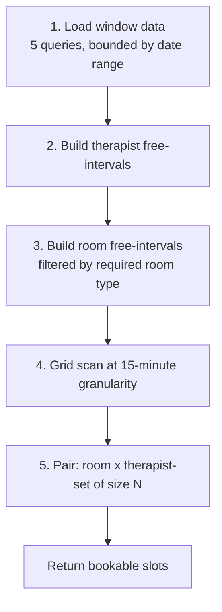

# Scheduling Engine Specification

**Version:** 1.0 · The core of the system. Read this before writing any scheduling code.
**Aligned to:** FRS v7 §5, §5.1, §6, §20, §21

> **Delivery posture.** The engine is built in full in Release 1 — multi-therapist pairing, room
> typing, the buffer, the 15-minute grid, the whole concurrency guarantee. Only the *client*
> booking channel is deferred: C10 (cut-off and horizon), slot holds, and the public availability
> response shape. They are specified here so the engine is written once, with the channel as a
> parameter rather than a later retrofit.

---

## 1. Problem Statement

Given a **location**, a **set of items** (one service variant plus optional add-ons), a **date
range**, and optionally a **requested therapist**, return every start time at which the appointment
can be booked.

Let `D` = the sum of item durations and `B` = `location.buffer_minutes` (15). A start time `t` is
bookable if there exists a room `r` and a set of `n` distinct therapists `S`
such that all of the following hold over `[t, t + D + B)`. Write `n` for
`variant.therapist_count` (1, or 2 for couples / four hands / couple head spa):

| # | Condition |
|---|---|
| C1 | The location is open (business hours 09:00–22:00, not a closure date) |
| C2 | Every therapist in `S` is **qualified** for every `service` and `add_on` item |
| C3 | Every therapist in `S` is assigned to this location |
| C4 | Every therapist in `S` has a **published shift** at this location fully covering the interval |
| C5 | No therapist in `S` has another appointment overlapping — **at any of the four locations** |
| C6 | No therapist in `S` has a shift break overlapping |
| C7 | The room is **active** and belongs to the location |
| C8 | The room has **no other appointment** overlapping |
| C9 | Neither a therapist nor the room has an unexpired **slot hold** overlapping |
| C10 | `t` respects the booking cut-off and the 6-month horizon (client channel only — *Release 2*) |
| C11 | The room's `room_type` is one of the variant's allowed room types |
| C12 | The free-therapist set has at least `therapist_count` members — two distinct therapists for couples, four hands and couple head spa |
| C13 | `t` falls on the location's 15-minute grid |

**C5 is the subtle one.** Because a therapist can be moved between locations, therapist conflicts
are **company-wide**, while room conflicts are **location-scoped**. Getting this wrong is the
classic multi-branch salon bug: Anna is booked at Luma 15:00 and at Belmont 15:00 on the same day.

**C12 is the other subtle one.** A couples massage that finds one free therapist and no second is not
bookable. Phase 5 must check the *cardinality* of the free-therapist set, not its non-emptiness.

### 1.1 The buffer is in the interval, not in the check

FRS §21 requires "a minimum 15-minute gap between appointments for the same room **and/or**
therapist." The implementation does **not** add a gap check anywhere:

```
appointments.starts_at        = t
appointments.service_ends_at  = t + D          ← what the client is told
appointments.ends_at          = t + D + B      ← what the schedule reserves
appointments.during           = [starts_at, ends_at)
```

Because `during` already carries the buffer, two back-to-back appointments 15 minutes apart do not
overlap, and two 10 minutes apart do. The gap rule is therefore enforced by the same exclusion
constraints that prevent double-booking — one mechanism, not two. The client-facing UI and the
day board both display `service_ends_at`; only the scheduler sees `ends_at`.

> **Consequence to be aware of.** The buffer trails the appointment rather than surrounding it. A
> 15-minute gap therefore exists after every appointment, which is what produces "a minimum
> 15-minute gap between appointments." A leading buffer would double-count and cost 15 minutes of
> sellable time per booking.

---

## 2. The Algorithm

### 2.1 Overview

```
Input:  location_id, items[] (service_variant_ids), date_from, date_to,
        [requested_staff_profile_id], [channel]
Output: [ { start_at, service_end_at, end_at,
            candidate_staff_ids[], candidate_room_ids[], therapists_required } ]
```

Five phases. Everything after phase 1 happens **in memory** on a small, pre-filtered dataset —
that is what keeps it inside the 500 ms budget.



### 2.2 Phase 1 — Load the window (5 queries, no N+1)

For `[date_from, date_to]` expanded to UTC bounds using the location's timezone
(`America/Chicago`):

```sql
-- Q1: candidate therapists with their published shifts at this location.
--     Qualification is checked against EVERY service in the request, not just the first.
SELECT s.id, s.staff_profile_id, s.starts_at, s.ends_at
FROM shifts s
JOIN staff_profiles sp
  ON sp.id = s.staff_profile_id AND sp.status = 'active'
WHERE s.location_id = :location_id
  AND s.status = 'published'
  AND s.during && tstzrange(:from_utc, :to_utc)
  AND (:requested_staff_profile_id IS NULL
       OR s.staff_profile_id = :requested_staff_profile_id)
  AND NOT EXISTS (                       -- C2: unqualified for ANY requested service
        SELECT 1 FROM unnest(:service_ids::bigint[]) AS need(service_id)
        WHERE NOT EXISTS (
          SELECT 1 FROM staff_qualifications q
          WHERE q.staff_profile_id = s.staff_profile_id
            AND q.service_id = need.service_id
            AND q.active));

-- Q2: ALL appointments for those therapists, across EVERY location  (C5)
SELECT ast.staff_profile_id, lower(ast.during) AS starts_at, upper(ast.during) AS ends_at
FROM appointment_staff ast
WHERE ast.staff_profile_id = ANY(:candidate_staff_ids)
  AND ast.status IN ('pending_approval','scheduled','checked_in','in_progress','completed')
  AND ast.during && tstzrange(:from_utc, :to_utc);

-- Q3: appointments occupying rooms at THIS location  (C8)
SELECT room_id, starts_at, ends_at
FROM appointments
WHERE location_id = :location_id
  AND status IN ('pending_approval','scheduled','checked_in','in_progress','completed')
  AND during && tstzrange(:from_utc, :to_utc);

-- Q4: shift breaks for those therapists  (C6)
SELECT sb.starts_at, sb.ends_at, s.staff_profile_id
FROM shift_breaks sb JOIN shifts s ON s.id = sb.shift_id
WHERE s.staff_profile_id = ANY(:candidate_staff_ids)
  AND sb.during && tstzrange(:from_utc, :to_utc);

-- Q5: unexpired holds  (C9)
SELECT staff_profile_ids, room_id, lower(during), upper(during)
FROM slot_holds
WHERE expires_at > now()
  AND during && tstzrange(:from_utc, :to_utc);
```

Plus cached lookups: business hours, closures, **active rooms filtered to the variant's allowed
room types** (C11), and room blocks.

> **`pending_approval` counts as occupied** in Q2 and Q3. A specific-therapist request holds the
> slot from the moment it is created, which is what makes BR-15 true — the slot cannot be taken out
> from under a client who is waiting for approval.

**Data volume check.** One location, 7-day window, 30 therapists, 8 rooms, ~20 appointments/day
≈ **1,500 rows**. In-memory interval arithmetic on 1,500 rows is sub-millisecond. There is no need
for a slot table, a materialised availability cache, or Redis. Resist all three — precomputed
availability caches are the primary source of stale-slot bugs in salon systems.

### 2.3 Phase 2 — Therapist free intervals

For each candidate therapist:

```
free[therapist] = union(published shifts at this location)
                − union(their appointments, ANY location)     ← already buffer-inclusive
                − union(their shift breaks)
                − union(their unexpired holds)
```

Interval subtraction on sorted, merged intervals. Result: a list of disjoint windows in which this
therapist could start something.

Note there is no separate buffer subtraction. Each appointment interval already extends 15 minutes
past its service end (§1.1), so the gap falls out of the arithmetic.

### 2.4 Phase 3 — Room free intervals

```
rooms = active rooms at this location WHERE room_type IN variant.allowed_room_types   ← C11

free[room] = (location open hours ∩ requested window)
           − union(appointments in that room)
           − union(unexpired holds on that room)
           − union(room_blocks overlapping the window)
```

Rooms of the wrong type are excluded in phase 1 and never enter the calculation. A couples massage
at Belmont therefore searches 4 rooms, not 6; a head spa at Luma searches 2, not 8.

### 2.5 Phase 4 — Grid scan

Candidate start times sit on a **15-minute grid** (`location.slot_granularity_minutes`), aligned to
the location's local wall clock and walking forward from opening time: 09:00, 09:15, 09:30, 09:45…
This is FRS §5.1 and §21 verbatim, and C13.

For each candidate `t`, require `[t, t + D + B) ⊆` some free interval.

For the **client channel** additionally require (C10) — *Release 2; Release 1 has no client
channel, and Owner/Manager booking is unconstrained by either bound*:

```
t >= now + location.booking_cutoff_minutes        (Owner sets 15 / 30 / 60)
t <= now + location.booking_horizon_days          (183 ≈ 6 months)
```

Owner and Manager booking ignores the cut-off — the front desk must be able to book a client who is
standing in front of them.

### 2.6 Phase 5 — Pairing

A slot is bookable if:

```
|{ therapists free at t }| >= variant.therapist_count      ← C12
AND
|{ rooms free at t }| >= 1
```

For single-therapist services this is a simple existence check. For **couples massage, four hands
and couple head spa** it is a **cardinality** check: two *distinct* therapists must be free for the
whole interval. Any therapist can use any room of the right type, so no bipartite matching is
needed — a count suffices.

Return the full candidate lists so the UI can offer therapist choice and so assignment can be
deferred to booking time.

### 2.7 Assignment policy (which therapist(s) and room to actually pick)

When the client expresses no preference, the default is **least-fragmentation**:

1. Prefer therapists whose free interval the appointment fits **snugly**, minimising leftover gaps
   too small to sell.
2. Tie-break: the therapist with the **fewest completed sessions that day**. Under piece-rate pay
   (FRS §4, §18) an idle therapist earns nothing, so spreading work is both fairer and better for
   retention than concentrating it.
3. Room: prefer the room that **already has an adjacent booking**, packing rooms densely so whole
   rooms — especially couple rooms — stay free for longer bookings.
4. For a two-therapist service, pick the pair that minimises combined fragmentation, not each
   therapist independently.

Make this a strategy object (`SlotAssignment::LeastFragmentation`) so the policy can change without
touching the search.

> **Note on the tie-break metric.** It counts *sessions*, not hours. Under piece-rate pay idle
> time costs the therapist rather than the business, so spreading work evenly is a retention
> measure, not a cost-control one — and sessions are what actually pay.

---

## 3. Specific-Therapist Requests

FRS §5 and §5.1. This is a scheduling concern, not a workflow afterthought, because the slot must
be held while approval is pending.

```
Client / Manager                System                     Owner / Manager
      |                            |                              |
      |-- book, requesting Anna -->|                              |
      |                            |-- create appointment         |
      |                            |   status = pending_approval  |
      |                            |   (Anna + room now occupied) |
      |                            |-- notify ------------------->|
      |<-- "confirmation within a few minutes" -------------------|
      |                            |<-- approve ------------------|
      |<-- email + SMS confirmation | status = scheduled          |
```

**If Anna is unavailable at the requested time** the system does not offer a different therapist.
It runs the availability search again with `requested_staff_profile_id = Anna` and an extended
window, and returns **Anna's next available time** (FRS §5):

```ruby
Scheduling::NextAvailableForTherapist.call(
  staff_profile_id: anna.id,
  location_id:, items:, after: requested_at, limit: 3
)
```

**Rejection** transitions the appointment to `cancelled` with reason `therapist_request_rejected`,
which frees the slot immediately, and notifies the client. No fee is ever recorded against the
client — they did not get what they booked. In Release 2, any deposit taken is refunded in full.

**Timeout.** Nothing in FRS v7 says what happens if nobody approves. See OQ-04 in doc 06. Until
that is answered, pending requests are surfaced on the Owner and Manager dashboards with an age
counter and are never auto-resolved.

---

## 4. Concurrency: How Double-Booking Is Actually Prevented

This is the part that must not rely on application logic.

### 4.1 The threat

Two managers at different locations, plus an online client, all commit a booking for Anna at 15:30
within the same 200 ms. A `SELECT … WHERE NOT EXISTS` check followed by an `INSERT` does **not**
prevent this at READ COMMITTED — all three see no conflict, all three insert.

### 4.2 The defence: Postgres exclusion constraints

```sql
CREATE EXTENSION IF NOT EXISTS btree_gist;

-- Room conflicts (buffer included in `during`) — location-scoped by construction,
-- since a room belongs to exactly one location.
ALTER TABLE appointments
  ADD COLUMN during tstzrange
    GENERATED ALWAYS AS (tstzrange(starts_at, ends_at, '[)')) STORED;

ALTER TABLE appointments
  ADD CONSTRAINT appointments_no_room_overlap
  EXCLUDE USING gist (room_id WITH =, during WITH &&)
  WHERE (status IN ('pending_approval','scheduled','checked_in','in_progress','completed'));

-- Therapist conflicts now live on the join table, and are deliberately GLOBAL (C5).
ALTER TABLE appointment_staff
  ADD CONSTRAINT appointment_staff_no_overlap
  EXCLUDE USING gist (staff_profile_id WITH =, during WITH &&)
  WHERE (status IN ('pending_approval','scheduled','checked_in','in_progress','completed'));
```

The second concurrent insert **fails at commit** with a constraint violation, regardless of
isolation level, application code path, or which process handled it. This is the guarantee.

### 4.3 Keeping `appointment_staff` in step

An exclusion constraint can only read columns on its own table, so `appointment_staff` carries a
denormalised `during` and `status`. A trigger maintains them:

```sql
CREATE FUNCTION sync_appointment_staff() RETURNS trigger AS $$
BEGIN
  UPDATE appointment_staff
     SET during = NEW.during, status = NEW.status
   WHERE appointment_id = NEW.id
     AND (during IS DISTINCT FROM NEW.during OR status IS DISTINCT FROM NEW.status);
  RETURN NEW;
END $$ LANGUAGE plpgsql;

CREATE TRIGGER trg_sync_appointment_staff
AFTER UPDATE OF starts_at, ends_at, status ON appointments
FOR EACH ROW EXECUTE FUNCTION sync_appointment_staff();
```

> **Why not check therapist conflicts in Ruby now that there can be two of them?** Because the
> race in §4.1 does not care how many therapists are involved. Moving the check to application code
> would surrender the one guarantee the business genuinely cannot tolerate breaking. The
> denormalised columns and this trigger are the price of keeping it in the database, and they are
> worth paying.
>
> A nightly job asserts that no `appointment_staff` row disagrees with its parent appointment, so
> trigger drift is detected rather than discovered.

### 4.4 Booking both therapists atomically

```ruby
class Scheduling::BookAppointment
  Conflict = Class.new(StandardError)

  def call(params)
    Appointment.transaction do
      appt = Appointment.create!(core_attributes(params))
      params[:staff_profile_ids].each_with_index do |id, i|
        AppointmentStaff.create!(
          appointment: appt, staff_profile_id: id,
          role: i.zero? ? :primary : :secondary,
          during: appt.during, status: appt.status
        )
      end
      appt
    end
  rescue ActiveRecord::StatementInvalid => e
    raise Conflict, 'slot_taken' if e.message.match?(/appointments_no_|appointment_staff_no_/)
    raise
  end
end
```

If the *second* therapist is taken, the whole transaction rolls back — there is no state in which a
couples massage exists with one therapist. The API returns **409 Conflict** with code `slot_taken`.
The client re-runs the search and shows "that time was just taken — here are the nearest options."
Treat the conflict as an expected, routine outcome, not an error to page on.

### 4.5 Slot holds for the online flow *(Release 2)*

Clients need the slot to survive checkout, which includes a Stripe payment step and is therefore
slower than an in-salon booking. Release 1 needs none of this: a Manager books in a single action,
so there is no window during which a slot must be reserved but uncommitted. A `slot_holds` row with `expires_at = now() + 10 minutes` reserves the room
and therapist set. Holds are:

- included as blockers in the availability query (C9),
- swept by a job every minute,
- deleted on successful booking or explicit abandon,
- **not** protected by an exclusion constraint — a stale hold blocking a slot for 10 minutes is a
  minor annoyance; a hold that hard-fails a booking is not. Holds are advisory; the appointment
  constraints are authoritative.

### 4.6 Reschedule and cancel

**Reschedule** = create the new booking, then release the old, inside one transaction:

```ruby
Appointment.transaction do
  old.update!(status: :cancelled, cancellation_reason: 'rescheduled')
  new = Appointment.create!(..., rescheduled_from_id: old.id)
end
```

Never mutate `starts_at` in place. A reschedule chain preserves history for the no-show and
retention reports and avoids momentarily violating the exclusion constraint against itself.

**Cancel** flips status, which drops the row out of both partial constraints' predicates and
instantly frees room and therapists (BR-21). No separate release step, no leaked reservation.

### 4.7 Shift editing races

```sql
ALTER TABLE shifts
  ADD CONSTRAINT shifts_no_staff_overlap
  EXCLUDE USING gist (staff_profile_id WITH =, during WITH &&)
  WHERE (status = 'published');
```

Additionally, **shortening or cancelling a published shift that already has appointments inside it
must be blocked**, not silently allowed (BR-07). Check for enclosed appointments before the update
and return 422 with the conflicting list. This applies equally when an approved **shift-change
request** is being applied — the approval endpoint runs the same guard, so a Manager cannot approve
a request that would orphan a booking.

---

## 5. Timezone Handling

All four locations are `America/Chicago` (FRS §25). The per-location timezone column stays anyway —
it costs one string and removes a migration if a fifth location ever opens elsewhere.

Rules, in order of importance:

1. Every `location` has an IANA `timezone`, not nullable, no default.
2. All instants are stored as `timestamptz` (UTC on disk).
3. All **business rules expressed in local terms** — the 09:00–22:00 day, "today's schedule", the
   **4-hour cancellation window**, the booking cut-off, the semi-monthly earnings boundaries, the
   reminder job — are evaluated in the **location's** timezone, never the server's, never the
   browser's.
4. The API accepts and returns **ISO 8601 with offset** (`2026-08-15T15:30:00-05:00`). Never a
   naked local time.
5. The client renders in Central with the abbreviation visible.
6. **DST transitions:** all four locations observe US DST. The 4-hour cancellation window and the
   fee jobs must be computed on instants, not on wall-clock arithmetic. A shift generated for
   09:00 local must land at 09:00 local on both sides of a transition — construct local datetimes
   in the location zone and convert, never add `7 * 86400` seconds. Test explicitly against the
   spring-forward and fall-back weekends.

```ruby
Time.use_zone(location.timezone) do
  local_start = Time.zone.parse("#{date} #{start_time}")
  shift.starts_at = local_start.utc
end
```

---

## 6. Performance Budget & Verification

| Operation | Budget | Approach |
|---|---|---|
| Availability, 1 location, 1 day | < 120 ms | 5 indexed queries + in-memory scan |
| Availability, 1 location, 7 days | < 500 ms | same, wider range |
| Availability, requested therapist | < 80 ms | narrower candidate set |
| Availability, two-therapist service, 7 days | < 600 ms | same scan, cardinality check in phase 5 |
| Book appointment | < 200 ms | insert + 1–2 join rows + constraints |
| Day board (all rooms, one location) | < 300 ms | one query, grouped client-side |
| Client-facing therapist name search | < 100 ms | trigram index, min 2 characters |

Cache **only** static reference data (locations, rooms, services, variants, prices, qualifications)
with explicit invalidation on write. **Never cache availability itself.**

### 6.1 Tests that must exist before this ships

Core scheduling correctness:

1. Concurrent booking of the same slot from N threads → exactly one succeeds, N−1 get 409.
2. A therapist booked at Luma is unavailable at Belmont for the same time.
3. The buffer blocks the room but is excluded from the client-facing service duration.
4. A slot at the very end of a shift, where `D + B` exceeds the shift end, is **not** offered.
5. An approved absence removes all slots for that date.
6. Cancelling frees the slot for immediate rebooking in the same request cycle.
7. DST spring-forward: a 09:00 shift stays at 09:00 local.
8. A therapist unqualified for the service never appears, even with an open shift and a free room.
9. Shortening a shift over an existing appointment is rejected with the conflicting list.
10. *(Release 2)* An expired slot hold no longer blocks the slot.

Specific to FRS v7's service mix and booking rules:

11. **Couples massage with only one free therapist is not offered** — cardinality, not existence.
12. Booking the second therapist of a couples massage into a taken slot rolls back the **whole**
    appointment; no half-created booking survives.
13. A couples massage is not offered into a `single` room even when the room is free.
14. A head-spa service at Luma is offered only into the two `head_spa` rooms.
15. A facial-and-body combination is bookable in a `single` room (FRS §20).
16. Two appointments 15 minutes apart in the same room both succeed; 10 minutes apart, the second
    gets 409.
17. A `pending_approval` appointment blocks the slot for every other channel.
18. Rejecting a therapist request frees the slot within the same request cycle, and records no
    fee against the client *(Release 2 additionally refunds the deposit in full)*.
19. *(Release 2)* Client-channel search returns nothing inside the cut-off window and nothing
    beyond 183 days, while the Manager channel returns both.
20. A 60-minute service plus a 30-minute add-on reserves 90 + 15 minutes and offers only slots
    where all 105 minutes are free.

Eighteen of the twenty are Release 1; tests 10 and 19 exercise the client channel and land with
Release 2.

**Do not proceed past Phase 1 until tests 1, 11, 12 and 16 are green.** They are the four that
cannot be retrofitted.
