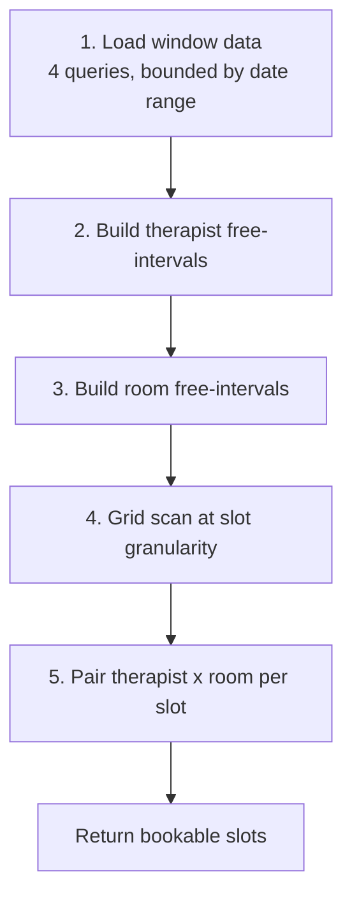

# Scheduling Engine Specification

**Version:** 1.0 · The core of the system. Read this before writing any scheduling code.

---

## 1. Problem Statement

Given a **location**, a **service variant** (duration D + buffer B), a **date range**, and
optionally a **preferred therapist**, return every start time at which an appointment can be
booked.

A start time `t` is bookable if there exists at least one pair `(therapist, room)` such that all of
the following hold over the interval `[t, t + D + B)`:

| # | Condition |
|---|---|
| C1 | The location is open (business hours, not a closure date) |
| C2 | The therapist is **qualified** for the service |
| C3 | The therapist is **assigned** to this location |
| C4 | The therapist has a **published shift** at this location fully covering the interval |
| C5 | The therapist has **no other appointment** overlapping — *at any location* |
| C6 | The therapist has **no approved time off** covering the date |
| C7 | The room is **active** and belongs to the location |
| C8 | The room has **no other appointment** overlapping |
| C9 | Neither the therapist nor the room has an unexpired **slot hold** overlapping |
| C10 | `t` respects lead time and booking horizon (online channel only) |

C5 is the subtle one. Because staff work at any location, therapist conflicts are **company-wide**,
while room conflicts are **location-scoped**. Getting this wrong is the classic multi-branch salon
bug: Anna gets booked at Downtown 15:00 and at Uptown 15:00 on the same day.

---

## 2. The Algorithm

### 2.1 Overview

```
Input:  location_id, service_variant_id, date_from, date_to,
        [staff_profile_id], [channel]
Output: [ { start_at, end_at, candidate_staff_ids[], candidate_room_ids[] } ]
```

Five phases. Everything after phase 1 happens **in memory** on a small, pre-filtered dataset —
that is what keeps it under the 500 ms budget.



### 2.2 Phase 1 — Load the window (4 queries, no N+1)

For the requested `[date_from, date_to]` expanded to UTC bounds using the **location's timezone**:

```sql
-- Q1: candidate therapists with their published shifts at this location
SELECT s.id, s.staff_profile_id, s.starts_at, s.ends_at, s.break_minutes
FROM shifts s
JOIN staff_qualifications q
  ON q.staff_profile_id = s.staff_profile_id
 AND q.service_id = :service_id
 AND q.active
JOIN staff_profiles sp
  ON sp.id = s.staff_profile_id
 AND sp.status = 'active'
WHERE s.location_id = :location_id
  AND s.status = 'published'
  AND s.during && tstzrange(:from_utc, :to_utc)
  AND (:staff_profile_id IS NULL OR s.staff_profile_id = :staff_profile_id);

-- Q2: ALL appointments for those therapists, across EVERY location  (C5)
SELECT staff_profile_id, starts_at, ends_at
FROM appointments
WHERE staff_profile_id = ANY(:candidate_staff_ids)
  AND status IN ('scheduled','checked_in','in_progress','completed')
  AND during && tstzrange(:from_utc, :to_utc);

-- Q3: appointments occupying rooms at THIS location  (C8)
SELECT room_id, starts_at, ends_at
FROM appointments
WHERE location_id = :location_id
  AND status IN ('scheduled','checked_in','in_progress','completed')
  AND during && tstzrange(:from_utc, :to_utc);

-- Q4: unexpired holds for those therapists and rooms  (C9)
SELECT staff_profile_id, room_id, lower(during), upper(during)
FROM slot_holds
WHERE expires_at > now()
  AND during && tstzrange(:from_utc, :to_utc)
  AND (staff_profile_id = ANY(:candidate_staff_ids) OR room_id = ANY(:room_ids));
```

Plus cached lookups: location business hours, closures, active rooms, approved time-off.

**Data volume check.** One location, 7-day window, 10 therapists, 8 rooms, 12 appointments/day ≈
**~600 rows total**. In-memory interval arithmetic on 600 rows is microseconds. There is no need
for a slot table, a materialised availability cache, or Redis. Resist all three — precomputed
availability caches are the primary source of stale-slot bugs in salon systems.

### 2.3 Phase 2 — Therapist free intervals

For each candidate therapist:

```
free[therapist] = union(published shifts at this location)
                − union(their appointments, ANY location)
                − union(their unexpired holds)
                − union(approved time off)
                − union(scheduled breaks)
```

Interval subtraction on sorted, merged intervals. Result: a list of disjoint windows in which this
therapist could start something.

### 2.4 Phase 3 — Room free intervals

```
free[room] = (location open hours ∩ requested window)
           − union(appointments in that room)
           − union(unexpired holds on that room)
           − union(room_blocks overlapping the window)
```

Rooms whose `status != 'active'` are excluded entirely in phase 1 and never enter this calculation.

### 2.5 Phase 4 — Grid scan

Generate candidate start times on a **slot granularity** grid (configurable per location; default
**15 minutes**), aligned to the location's local wall clock, walking forward from opening time.

> **Why a grid at all?** Continuous availability produces "14:07" slots that nobody wants and that
> fragment the schedule. A 15-minute grid keeps the day packable. Set granularity to 30 minutes if
> the salon prefers rounder times — it is a per-location configuration, not a code change.

For each candidate `t`, require `[t, t + D + B) ⊆` some free interval.

### 2.6 Phase 5 — Pairing

A slot is bookable if `∃ therapist` free at `t` **and** `∃ room` free at `t`. Note these are
independent existence checks — since any therapist can use any room (no room typing), a simple
count check suffices, no bipartite matching required.

Return the full candidate lists so the UI can offer therapist choice, and so assignment can be
deferred.

### 2.7 Assignment policy (which therapist/room to actually pick)

When the customer does not choose, the default is **least-fragmentation**:

1. Prefer a therapist whose free interval the appointment fits **snugly** (minimises leftover gaps
   too small to sell).
2. Tie-break: the therapist with the **fewest booked hours** that day — spreads load fairly, which
   matters because pay is by shift hours, so under-booked therapists cost money without earning.
3. Room: prefer the room that **already has an adjacent booking**, packing rooms densely so whole
   rooms stay free for longer bookings.

Make this a strategy object (`SlotAssignment::LeastFragmentation`) so the policy can change without
touching the search.

---

## 3. Reschedule and Cancel

**Reschedule** = create the new booking, then release the old, inside one transaction:

```ruby
Appointment.transaction do
  old.update!(status: :cancelled, cancellation_reason: 'rescheduled')
  new = Appointment.create!(..., rescheduled_from_id: old.id)
end
```

Never mutate `starts_at` in place. A reschedule chain preserves history for the no-show/retention
reports and avoids momentarily violating the exclusion constraint against itself.

**Cancel** flips status, which drops the row out of the partial exclusion constraint's predicate
and instantly frees both resources (BR-14). No separate release step, no possibility of a leaked
reservation.

---

## 4. Concurrency: How Double-Booking Is Actually Prevented

This is the part that must not rely on application logic.

### 4.1 The threat

Two front-desk users at different branches, plus an online customer, all commit a booking for
Anna at 15:30 within the same 200 ms. A `SELECT … WHERE NOT EXISTS` check followed by an `INSERT`
does **not** prevent this at READ COMMITTED — both transactions see no conflict, both insert.

### 4.2 The defence: Postgres exclusion constraints

```sql
CREATE EXTENSION IF NOT EXISTS btree_gist;

ALTER TABLE appointments
  ADD COLUMN during tstzrange
    GENERATED ALWAYS AS (tstzrange(starts_at, ends_at, '[)')) STORED;

ALTER TABLE appointments
  ADD CONSTRAINT appointments_no_room_overlap
  EXCLUDE USING gist (room_id WITH =, during WITH &&)
  WHERE (status IN ('scheduled','checked_in','in_progress','completed'));

ALTER TABLE appointments
  ADD CONSTRAINT appointments_no_staff_overlap
  EXCLUDE USING gist (staff_profile_id WITH =, during WITH &&)
  WHERE (status IN ('scheduled','checked_in','in_progress','completed'));
```

The second concurrent insert **fails at commit** with a constraint violation, regardless of
isolation level, application code path, or which server node handled it. This is the guarantee.

Note the staff constraint has **no location predicate** — it is deliberately global (C5).

### 4.3 Application handling

```ruby
class Scheduling::BookAppointment
  Conflict = Class.new(StandardError)

  def call(params)
    Appointment.create!(params)
  rescue ActiveRecord::StatementInvalid => e
    raise Conflict, 'slot_taken' if e.message.include?('appointments_no_')
    raise
  end
end
```

The API returns **409 Conflict** with code `slot_taken`. The AngularJS booking view catches 409,
re-runs the availability search, and shows "that time was just taken — here are the nearest
options." Treat the conflict as an expected, routine outcome — not an error to log and page on.

### 4.4 Slot holds for the online flow

Online customers need the slot to survive the checkout form. A `slot_holds` row with
`expires_at = now() + 10 minutes` reserves the pair. Holds are:

- included as blockers in the availability query (C9),
- swept by a job every minute,
- deleted on successful booking or explicit abandon,
- **not** protected by an exclusion constraint — a stale hold blocking a slot for 10 minutes is a
  minor annoyance; a hold that hard-fails a booking is not. Holds are advisory; the appointment
  constraint is authoritative.

### 4.5 Shift editing races

The same pattern applies to shifts:

```sql
ALTER TABLE shifts
  ADD CONSTRAINT shifts_no_staff_overlap
  EXCLUDE USING gist (staff_profile_id WITH =, during WITH &&)
  WHERE (status = 'published');
```

Additionally, **shortening or cancelling a published shift that already has appointments inside it
must be blocked**, not silently allowed. Check for enclosed appointments before the update and
return a 422 listing them. Orphaned appointments outside any shift break both payroll and
utilisation reporting.

---

## 5. Timezone Handling

Rules, in order of importance:

1. Every `location` has an IANA `timezone`. It is **not** nullable and has no default.
2. All instants are stored as `timestamptz` (UTC on disk).
3. All **business rules expressed in local terms** — opening hours, "today's schedule", the
   24-hour cancellation window, the daily reminder job — are evaluated in the **location's**
   timezone, never the server's, never the user's browser.
4. The API accepts and returns **ISO 8601 with offset** (`2026-08-15T15:30:00-04:00`). Never a
   naked local time.
5. The AngularJS client renders in the **selected location's** timezone with the abbreviation
   visible, so a manager in one timezone viewing another branch is never confused.
6. **DST transitions:** generating recurring shifts across a DST boundary must produce shifts at
   the same *local* wall time, which means a different UTC instant. Materialise pattern-based
   shifts by constructing local datetimes in the location zone and converting — do not add
   `7 * 86400` seconds. Test explicitly against the spring-forward and fall-back weekends.

```ruby
Time.use_zone(location.timezone) do
  local_start = Time.zone.parse("#{date} #{pattern.start_time}")
  shift.starts_at = local_start.utc
end
```

---

## 6. Performance Budget & Verification

| Operation | Budget | Approach |
|---|---|---|
| Availability, 1 location, 1 day | < 120 ms | 4 indexed queries + in-memory scan |
| Availability, 1 location, 7 days | < 500 ms | same, wider range |
| Availability, preferred therapist | < 80 ms | narrower candidate set |
| Book appointment | < 200 ms | single insert + constraint |
| Day view (all rooms, one location) | < 300 ms | one query, grouped client-side |

Cache **only** static reference data (locations, rooms, services, variants, prices, qualifications)
in the Rails cache with explicit invalidation on write. **Never cache availability itself.**

### 6.1 Tests that must exist before this ships

1. Concurrent booking of the same slot from N threads → exactly one succeeds, N−1 get 409.
2. Therapist booked at location A is unavailable at location B for the same time.
3. Buffer time blocks the room but is excluded from the customer-facing service duration.
4. A slot at the very end of a shift, where duration + buffer exceeds the shift end, is **not**
   offered.
5. Approved time off removes all slots for that date.
6. Cancelling frees the slot for immediate rebooking in the same request cycle.
7. DST spring-forward: a recurring 09:00 shift stays at 09:00 local.
8. A therapist unqualified for the service never appears, even with an open shift and a free room.
9. Shortening a shift over an existing appointment is rejected with the conflicting list.
10. An expired slot hold no longer blocks the slot.
