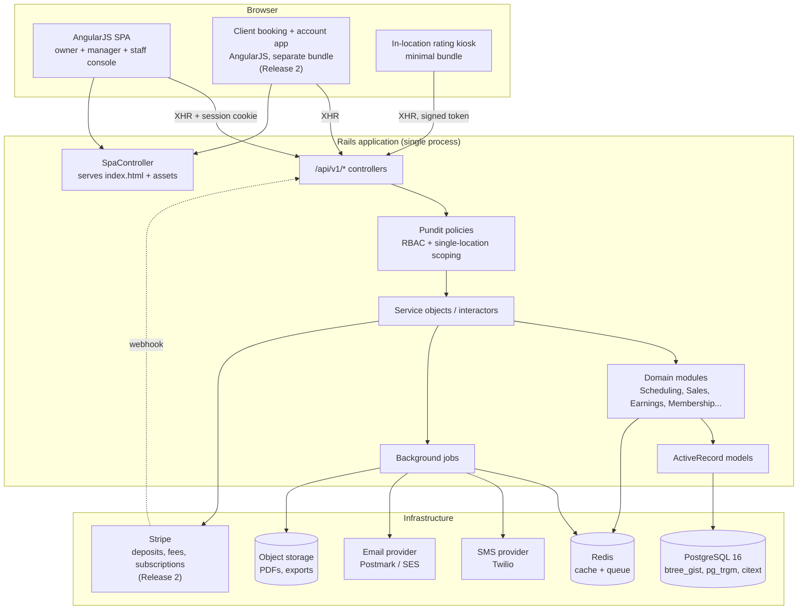
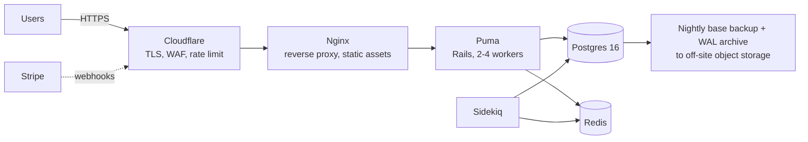

# System Architecture

**Version:** 1.0 · Rails API + AngularJS SPA, single project, single Postgres
**Aligned to:** FRS v7

> **Delivery posture.** Release 1 is an **internal management platform**: the console and the
> rating kiosk, operated by Owner, Manager and Therapist. The client bundle, client authentication
> and the entire Stripe surface are specified here in full but deferred to Release 2 (doc 06 §1).
> Sections that describe Release 2 only are marked. Nothing about the Release 1 architecture needs
> to change when Release 2 arrives — that is the point of specifying it now.

---

## 1. Architectural Style

**A modular monolith.** One Rails application, one database, internal module boundaries enforced by
convention and namespacing.

**Why not microservices.** Four locations, one company, one team. The dominant operation — the
availability search — needs shifts, appointments, rooms, staff, qualifications and room types in a
single consistent read, and the one invariant the business cannot tolerate breaking
(double-booking a room or a therapist) is protected by Postgres exclusion constraints spanning two
tables. Splitting that across services would require distributed transactions or eventual
consistency to protect exactly the thing that must never be eventually consistent. Revisit only if
this becomes multi-tenant SaaS sold to other salons.



---

## 2. Serving the AngularJS Frontend from Rails

One project, Rails serves the JS.

### 2.1 Layout

```
app/
  controllers/
    spa_controller.rb             # the staff console shell
    client_app_controller.rb      # the client booking + account shell
    kiosk_controller.rb           # the in-location rating screen
    api/v1/...                    # JSON only, no views
  frontend/                       # AngularJS source (not app/assets)
    console/
      app.module.js
      core/            # http interceptor, auth, location switcher, tz helpers
      shared/          # components, filters
      features/
        dashboard/     # owner dashboard (FRS 15)
        calendar/      # day board: rooms x time, 09:00-22:00
        appointments/
        clients/
        staff/
        shifts/        # incl. the approval queue for shift/location requests
        catalogue/     # service menu management (FRS 19)
        sales/
        giftcards/
        membership/
        earnings/      # FRS 4, 8
        reports/
    client/
      booking.module.js           # service -> location -> date -> slot -> pay
      account.module.js           # my bookings, my gift cards, my membership
    kiosk/
      rating.module.js
```

### 2.2 Build

**Vite Ruby** (`vite_rails`) rather than Sprockets: ES modules, hashed filenames, HMR in
development, and separate entry points per bundle. AngularJS 1.8.x works fine as an npm dependency
under Vite.

```ruby
# config/routes.rb
root 'client_app#show'
get '/book(/*path)',    to: 'client_app#show'
get '/account(/*path)', to: 'client_app#show'
get '/app(/*path)',     to: 'spa#show', as: :console
get '/kiosk(/*path)',   to: 'kiosk#show'

namespace :api do
  namespace :v1 do
    # ... see 05-api-design.md
  end
end
```

Each controller renders a minimal ERB layout with `vite_javascript_tag`. The catch-all `*path` lets
AngularJS own client-side navigation while deep links still work on refresh.

### 2.3 Three bundles, not one

Release 1 ships the **console** and the **kiosk**; the client bundle arrives with Release 2. The
split is decided now because it is a routing and build-config decision that is awkward to retrofit,
and because it carries a security property worth having from the start.

Keep the client-facing app in a **separate bundle with no shared authenticated code**, and the
kiosk in a third, smaller one. Reasons:

- It loads faster for clients.
- It makes it structurally impossible for a bug to leak staff-only UI or data models to the public.
- **It is how BR-13 is enforced in depth.** The client bundle contains no therapist-roster
  component, no roster API service, and no code path that could render one. The privacy rule that
  "the full staff list is never browsable in the client-facing flow" (FRS §5.1) is then a property
  of the deployed artefact, not only of a server-side check.
- The kiosk sits on an unattended screen in a public room. Giving it its own bundle and its own
  short-lived signed token means a walk-up user cannot reach anything else.

### 2.4 AngularJS-specific guidance

AngularJS 1.x is end-of-life upstream. That is an acceptable, deliberate choice for an internal
tool, but architect so a future migration is not a rewrite:

- Keep **all business logic in Rails**, none in Angular services. The client is a thin view over
  the API. Fee percentages, the 4-hour window, the credit cap, price resolution and the pay ladder
  are all server-side; the client never computes money.
- Use **`.component()`**, not `.directive()` with scopes, and one-way bindings (`<`) throughout.
- No `$scope` soup — `controllerAs` + `vm` everywhere.
- Isolate all HTTP access behind a per-resource service (`AppointmentApi`, `ShiftApi`) so swapping
  the view layer touches only components.
- A single `$http` interceptor handles CSRF, 401 → login, 409 → conflict event, 422 → form errors.
- **Stripe Elements is mounted directly, not wrapped.** Card fields live in Stripe's iframe; our
  Angular code never sees a card number. This is what keeps PCI scope at SAQ-A.

---

## 3. Backend Module Structure

```
app/
  models/                        # thin ActiveRecord: associations, validations, scopes
  policies/                      # Pundit: one per resource
  services/
    scheduling/
      availability_search.rb            # doc 03 section 2
      next_available_for_therapist.rb   # FRS 5 - same therapist, next time
      book_appointment.rb
      reschedule_appointment.rb
      cancel_appointment.rb             # applies the 4h fee rule
      transition_status.rb
      approve_therapist_request.rb
      slot_assignment/least_fragmentation.rb
    workforce/
      onboard_staff.rb
      offboard_staff.rb
      submit_staff_request.rb
      approve_staff_request.rb          # enforces owner-only for location changes
      publish_shifts.rb
    catalogue/
      resolve_price.rb                  # location price -> base, effective-dated
      compute_appointment_duration.rb   # sum of item durations
    sales/
      open_order.rb
      add_line_item.rb
      record_payment.rb                 # 'recorded' methods
      capture_deposit.rb                # Stripe, online booking
      charge_cancellation_fee.rb        # Stripe off-session, 20%
      refund_order.rb
      allocate_tips.rb
      settle_order.rb
    gift_cards/
      issue_card.rb
      issue_digital_card.rb
      redeem_card.rb
      reconcile_balances.rb
      expire_cards.rb
    membership/
      enrol_member.rb
      grant_monthly_credit.rb           # cap at 3
      redeem_credit.rb
      price_upgrade.rb                  # the difference the member pays
      request_cancellation.rb           # 15-day notice rule
    earnings/
      generate_earning_lines.rb         # on appointment completion
      add_manual_line.rb                # FRS 4, owner only
      build_statements.rb               # semi-monthly and custom
      lock_period.rb
    crm/
      merge_clients.rb
      update_preferences.rb             # versioned
      record_care_note.rb               # append-only
      record_rating.rb
    reporting/
      owner_dashboard.rb
      daily_revenue_report.rb
      client_log_report.rb
      staff_earnings_report.rb
      gift_card_liability_report.rb
      membership_report.rb
      ratings_report.rb
  queries/                       # read-side objects for reports and lists
  serializers/                   # JSON shaping (Alba or Blueprinter)
  jobs/
```

**Conventions:**

- Controllers are thin: authorise → call one service object → serialise. No business logic.
- Every service object exposes `#call` and returns a Result (`Success`/`Failure` with an error code).
- Models never call other modules' models across a boundary; they go through service objects.
- All multi-table writes run inside an explicit `transaction do`.
- **Any call to Stripe happens outside the database transaction**, with the local record written
  first in a pending state and reconciled by webhook. Holding a Postgres transaction open across a
  network call to a third party is how connection pools die.

---

## 4. Authentication & Authorisation

### 4.1 Staff authentication — session cookies, not JWT

The console is **same-origin** with the API, so use Rails **httpOnly session cookies**:

```ruby
# config/initializers/session_store.rb
Rails.application.config.session_store :cookie_store,
  key: '_massagelab_session',
  httponly: true,
  secure: Rails.env.production?,
  same_site: :lax,
  expire_after: 12.hours
```

JWT in `localStorage` is XSS-exfiltratable and gives no server-side revocation. With httpOnly
cookies plus `protect_from_forgery with: :exception` and a CSRF token surfaced to Angular via a meta
tag, sessions are revocable and the token is XSS-resistant. There is no mobile app or third-party
API consumer here that would justify bearer tokens.

- Password hashing: bcrypt via `has_secure_password`.
- Session timeout: 12 hours sliding. **Manager terminals get a 30-minute idle timeout** — the
  manager is the front desk and sits in a public-facing area.
- Failed-login lockout after 10 attempts.
- **Two-factor (TOTP) required for the Owner account.** It is the only account that can see every
  location's money, change pay rates, adjust gift card balances and lock earnings periods.
  Recommended but not forced for Managers.

### 4.2 Client authentication — phone + SMS one-time code *(Release 2)*

> No client authenticates in Release 1. The `client` role exists in the enum and the policies
> handle it, but no such account is ever issued. What follows is the Release 2 design.

FRS §22 leaves the mechanism to us and asks only that it be simple and secure. Chosen: **phone
number + 6-digit SMS code**, with optional email/password as a fallback.

- The phone number is already the client's identity everywhere else in the business, is already the
  front desk's search key, and is already a channel we pay for.
- No password to forget, reset, or reuse from a breached site.
- Codes are single-use, 10-minute TTL, rate-limited per phone and per IP, and constant-time
  compared.
- Client sessions use a **different cookie key and a different scope** from staff sessions. A
  client session can never satisfy a staff policy check, even in the presence of a routing mistake.

### 4.3 Authorisation — Pundit, two dimensions

Every request is checked on **role** and **location scope**. The scope dimension is deliberately
narrow: a Manager belongs to exactly one location and cannot switch (FRS §2).

```ruby
class AppointmentPolicy < ApplicationPolicy
  def index?  = user.owner? || user.manager? || user.staff?
  def create? = user.owner? || user.manager?          # BR-14: staff cannot create

  class Scope < Scope
    def resolve
      case user.role
      when 'owner'   then scope.all
      when 'manager' then scope.where(location_id: user.location_id)
      when 'staff'   then scope.joins(:appointment_staff)
                              .where(appointment_staff: { staff_profile_id: user.staff_profile_id })
      when 'client'  then scope.where(client_id: user.client_id)
      else scope.none
      end
    end
  end
end
```

> Note the `staff` scope joins `appointment_staff` rather than filtering a column. With
> two-therapist services, "my appointments" means "appointments I am on", and the secondary
> therapist on a couples massage must see it too.

**Permission matrix (authoritative — mirrors doc 01 §2.1):**

| Capability | Owner | Manager | Staff | Client |
|---|:--:|:--:|:--:|:--:|
| Switch between all four locations | ✓ | ✗ (1 location) | ✗ | n/a |
| View day board / schedule | ✓ all | ✓ own location | own only | ✗ |
| Create appointment | ✓ | ✓ | **✗** | own only |
| Reschedule / cancel appointment | ✓ | ✓ | ✗ | own only |
| Check in / start / complete | ✓ | ✓ | ✓ own | ✗ |
| Take payment, settle order | ✓ | ✓ | ✗ | own, online |
| Add / edit client | ✓ | ✓ | ✗ | own profile |
| View client profile & history | ✓ | ✓ | own appts only | own only |
| **Read preferences form & care notes** | ✓ | ✓ | own appts only | own preferences only |
| Write care note | ✗ | ✗ | ✓ own appts | ✗ |
| Manage staff, onboard / offboard | ✓ | ✗ | ✗ | ✗ |
| **View / edit pay rates** | ✓ | **✗** | own rate, read-only | ✗ |
| **View earnings** | ✓ all | **✗** | own only | ✗ |
| Manual earnings adjustment | ✓ | ✗ | ✗ | ✗ |
| Lock earnings period | ✓ | ✗ | ✗ | ✗ |
| Create / edit / publish shifts | ✓ | ✓ | ✗ | ✗ |
| Submit shift-change request | ✗ | ✗ | ✓ own | ✗ |
| Approve shift-change request | ✓ | ✓ | ✗ | ✗ |
| **Approve location-change request** | ✓ | **✗** | ✗ | ✗ |
| Approve specific-therapist request | ✓ | ✓ | ✗ | ✗ |
| Manage service menu | ✓ | ✗ | view; edit if granted | view |
| **Sell / view gift cards** | ✓ | ✓ | **✗** | buy own, online |
| **Adjust gift card balance / void payment** | ✓ | **✗** | ✗ | ✗ |
| Enrol / cancel membership | ✓ | ✓ | ✗ | own |
| Owner financial reports | ✓ | **✗** | ✗ | ✗ |

`verify_authorized` and `verify_policy_scoped` as `after_action` on every API controller, so a
forgotten check fails loudly in tests rather than silently leaking data.

### 4.4 The three rules that need enforcing twice

Some rules in FRS v7 are specific enough, and consequential enough, that a policy check alone is
not sufficient. Each is enforced in the policy layer **and** in the database:

| Rule | Policy layer | Database |
|---|---|---|
| Only the Owner may approve a location change (FRS §2, §3) | `StaffRequestPolicy#approve?` | `CHECK (kind <> 'location_change' OR reviewer_role = 'owner')` |
| Exactly one Manager per location (confirmed) | validation on `User` | partial unique index on `users (location_id) WHERE role = 'manager'` |
| Manager never sees rates or earnings | policy + serialiser field list | rates and earnings live in tables no manager-scoped query touches |

### 4.5 Client-facing therapist privacy (BR-13)

FRS §5.1 is unusually specific: the client sees "No preference" by default, types a name to search,
and **the full staff list is never browsable**. Three layers:

1. **No roster endpoint exists on the public surface.** There is no
   `GET /api/v1/public/therapists` that returns a list.
2. The search endpoint `GET /api/v1/public/therapists/search?q=` requires **at least 2
   characters**, returns at most 5 matches, exposes only `id` and `display_name` (first name), and
   is rate-limited per IP and per session. A one-character query returns 422, not a full roster.
3. The client bundle contains no roster component (§2.3).

Availability responses on the public channel likewise carry no therapist identities unless the
client already named one — they return times only.

---

## 5. Protecting Sensitive Client Information

FRS v7 does not ask for a health intake questionnaire, a consent waiver, or SOAP notes, and those
are out of scope. What remains is still sensitive: the **preferences form**
("areas to avoid", "areas to pay more attention to", pressure) and **care notes** — the therapist's
log of what to avoid and what to consider next session.

This is body-related information about an identifiable person. A massage business that does not
bill insurance is usually not a HIPAA covered entity, but Illinois law and simple duty of care
apply regardless, and the reputational cost of a leak is severe. Treat it as protected either way,
while being clear it is **not** a clinical record and must not be presented as one.

1. **Encryption at rest, column level.** Rails 7+ Active Record Encryption on
   `client_preferences.attention_areas`, `.avoid_areas`, `.other_requests` and `care_notes.body`,
   non-deterministic (these are never searched). Keys held outside the database in Rails
   credentials or a secrets manager, so a database dump alone is not a breach.
2. **Access logging on read, not just write.** Every view of a care note or a preferences form
   writes an `audit_logs` row. This is the only way to answer "who looked at this."
3. **Staff scoped to their own appointments.** A therapist cannot browse the client base; they see
   the preferences and care history of the clients they are actually scheduled with.
4. **Care notes are append-only.** A correction is a new note superseding the original.
5. **No sensitive fields in logs.** Add them to `config.filter_parameters`. Verify with a
   log-scanning test.
6. **Nothing sensitive in email or SMS.** Reminders reference the appointment, never its content.
   The rating SMS carries a signed token and a therapist first name, nothing more.
7. **TLS everywhere**, HSTS, `force_ssl = true`.

---

## 6. Payments Architecture

**Release 1 records payments; it does not process any.** Every payment is entered by a Manager
after the existing card terminal, the cash drawer or a Zelle transfer has already done the work.
There is no gateway, no stored card, no PCI scope beyond what the terminal already carries, and no
third-party dependency in the checkout path.

FRS v7 nonetheless requires money to be **collected** in four places — booking deposits, full
prepayment, no-show and late-cancellation fees, and the monthly membership subscription. All four
are client-facing or automatic, and all four are **Release 2**. §6.2 onward specifies them so the
Release 1 data model is already shaped to receive them.

### 6.0 What Release 1 does instead

| FRS requirement | Release 1 behaviour |
|---|---|
| 20% deposit or prepayment at booking (§5.1) | Not applicable — there is no online booking. Internally booked appointments are paid at checkout. |
| 20% no-show / late-cancellation fee (§21) | Calculated on the same 4-hour rule, then written as an **open `Fee` order line** rather than charged. The Manager sees it when that client next books and collects it at checkout. See doc 02 §3.7. |
| $80/month membership (§23) | Enrolment, credits, the 3-credit cap, upgrades and the 15-day notice all work. The monthly payment is **recorded by hand**, and recording it is what grants the credit. |
| Refunds | A fee-free cancellation has nothing to refund, because nothing was taken. |

The cost of this is a revenue leak on no-shows and a monthly manual step per member. Both are
stated as risks in doc 07 §3, and both disappear in Release 2.

### 6.1 Two payment worlds, deliberately kept apart *(from Release 2)*

| | In salon | Online |
|---|---|---|
| Methods | Card (existing terminal), Cash, Zelle, Gift Card, Other | Card via Stripe, Gift Card |
| Mechanism | **Recorded** — a Manager types in what the terminal already did | **Processed** — Stripe PaymentIntent |
| `payments.processing` | `recorded` | `gateway` |
| PCI scope | None — no card data enters the system | **SAQ-A** — tokenised client-side by Stripe Elements |
| Tips | Terminal prompts 20 / 25 / 30 / custom, result typed in | Not taken online; tips happen at checkout |

Keeping these apart in one column, rather than in two subsystems, means the daily revenue report
(FRS §10) sums one table across both worlds while reconciliation, refund mechanics and error
handling stay distinct.

### 6.2 Deposits and prepayment (FRS §5.1) *(Release 2)*

At online booking the client chooses **20% deposit** or **full payment**:

```
1. Client selects slot            -> slot_hold created (10 min)
2. Client confirms amount choice  -> POST /api/v1/public/appointments
3. Server creates appointment (pending payment), returns Stripe client_secret
4. Stripe Elements confirms the PaymentIntent in the browser
5. Webhook payment_intent.succeeded -> appointment becomes scheduled
                                        (or pending_approval if a therapist was named)
6. Email + SMS confirmation
```

The card is saved (`setup_future_usage: 'off_session'`) so the cancellation fee can be charged
later. **This requires explicit consent** to the cancellation policy at booking, stored with a
timestamp on `stripe_customers.cancellation_policy_agreed_at` (RISK-02). Stripe requires it; so
does basic fairness.

### 6.3 Cancellation and no-show fees (FRS §21) *(Release 2 charging; Release 1 records the amount owed)*

| Event | Fee | Refund |
|---|---|---|
| Cancel ≥ 4 hours before start | none | full refund of deposit or prepayment |
| Cancel < 4 hours before start | 20% of appointment total | remainder refunded |
| No-show | 20% of appointment total | remainder refunded |
| Therapist request rejected by us | none | full refund |

`Sales::ChargeCancellationFee` runs off-session against the saved card when the deposit does not
cover the fee, and as a partial refund when it does. Every fee writes a `Fee` order line with
`revenue_category = 'fee'` — never service revenue, never a liability (BR-48) — and triggers the
`fee_charged` notification (FRS §22).

A `MarkNoShowsJob` **proposes** no-shows for appointments more than 30 minutes past start and
surfaces them for Manager confirmation. It never auto-charges: charging a card because nobody
pressed "check in" is the kind of automation that generates chargebacks.

### 6.4 Membership subscriptions (FRS §23) *(Release 2)*

Stripe Subscriptions at $80/month. The local `memberships` record is the source of truth for
**entitlement**; Stripe is the source of truth for **billing state**, reconciled by webhook:

| Webhook | Action |
|---|---|
| `invoice.paid` | Close the cycle, attempt `Membership::GrantMonthlyCredit` (capped at 3 — BR-38) |
| `invoice.payment_failed` | Membership → `past_due`; credits are not granted |
| `customer.subscription.deleted` | Membership → `cancelled` |

The **15-day cancellation notice** (BR-40) is ours, not Stripe's: a request inside the window sets
`cancellation_effective_at` to the end of the *following* period and schedules the Stripe
cancellation for then. FRS §22 explicitly forbids a renewal reminder and a cancellation-window
reminder, so neither is implemented — noted here so its absence reads as a decision.

### 6.5 Webhook handling *(Release 2)*

- Signature verified with the endpoint secret on every request.
- Handler is **idempotent by Stripe event id** (`processed_stripe_events` table with a unique
  index). Stripe retries; retries must be free.
- Handler enqueues a job and returns 200 immediately. Slow webhook handlers get disabled by Stripe.
- Local state is never advanced by the browser's success callback alone — the webhook is
  authoritative. A client who closes the tab mid-redirect still gets their booking.

---

## 7. Notifications: Email and SMS

FRS §22 requires both channels for confirmations, plus a reminder and a fee-charge notice.

| Template | Email | SMS | Trigger |
|---|:--:|:--:|---|
| `booking_confirmation` | ✓ | ✓ | Appointment reaches `scheduled` |
| `therapist_request_approved` / `_rejected` | ✓ | ✓ | Approval decision (FRS §5) |
| `appointment_reminder_24h` | ✓ | ✓ | 24 hours before start |
| `appointment_reminder_2h` | ✓ | ✓ | 2 hours before start — the second touch that actually reduces no-shows |
| `low_rating_alert` | ✓ | ✓ | To **Owner and location Manager** when a rating falls **below** the threshold — 1–5 by default (BR-45a) |
| `fee_charged` | ✓ | ✓ | No-show or late-cancellation fee taken |
| `rating_request` | — | ✓ | Appointment `completed`, link tied to the therapist. **SMS only** — FRS §11.2 specifies a text link |
| `gift_card_delivered` | ✓ | — | *Release 2* — digital gift card purchased online |
| ~~membership renewal reminder~~ | — | — | **Explicitly out of scope (FRS §22)** |
| ~~cancellation window reminder~~ | — | — | **Explicitly out of scope (FRS §22)** |

- Provider: Twilio for SMS, Postmark or SES for email. Both behind an adapter so a provider swap is
  one class.
- Every send writes a `notifications` row with `provider_message_id`, so "did the client get the
  reminder" is answerable.
- **STOP is honoured**; an opted-out client still receives email. SMS consent is captured at
  account creation (RISK-03).
- All scheduling is evaluated in the location's timezone. A reminder must never fire at 03:00.

---

## 8. Background Jobs

**Sidekiq + Redis**, or Solid Queue on Postgres if you prefer to drop the Redis dependency —
acceptable at this scale, and one fewer service to operate.

| Job | Schedule | Purpose |
|---|---|---|
| `SendAppointmentRemindersJob` | every 15 min | Both reminders — 24 h and 2 h before start — driven by `locations.reminder_offsets_minutes`, evaluated in the location's tz |
| `AutoApproveTherapistRequestsJob` | every 5 min | Approve requests pending >45 min, **but only after re-checking that the therapist still has a covering shift and no conflict**; otherwise escalate (BR-15a). 45 min is the backstop — the review target is 15 |
| `SweepExpiredSlotHoldsJob` | every minute | *Release 2* — delete expired holds |
| `MarkNoShowsJob` | every 30 min | Propose no-shows >30 min past start for Manager confirmation — never auto-commits |
| `ChargePendingFeesJob` | every 15 min | *Release 2* — charge confirmed no-show / late-cancel fees off-session. Release 1 leaves the fee as an open order line instead |
| `SendRatingRequestsJob` | every 15 min | SMS the rating link after completion (FRS §11.2) |
| `ExpireGiftCardsJob` | nightly | Flag past-expiry cards as `expired` **for reporting only** — no ledger row, no balance change; the card stays redeemable (BR-30) |
| `ReconcileGiftCardBalancesJob` | nightly | Assert ledger sum == cached balance; alert on drift (BR-25) |
| `ReconcileMembershipCreditsJob` | nightly | Same assertion for membership credits |
| `OutstandingFeesReportJob` | weekly | *Release 1* — list unpaid `Fee` orders per location. The front desk is **not** warned at booking time, so this digest is the only thing standing between an unpaid fee and it being forgotten |
| `VerifyAppointmentStaffSyncJob` | nightly | Assert every `appointment_staff` row matches its parent (doc 03 §4.3) |
| `GenerateEarningPeriodsJob` | 1st and 16th, 03:00 | Open the next semi-monthly period, close the previous (FRS §8) |
| `BuildEarningStatementsJob` | 1st and 16th, 04:00 | Build statements for the closed period |
| `RefreshReportingViewsJob` | nightly 04:00 | Refresh materialised views |
| `PrintableDailyScheduleJob` | daily 06:00 | Email each location its day sheet — the paper fallback |
| `NightlyBackupVerifyJob` | nightly | Confirm the backup completed and is restorable |

**Idempotency:** every job must be safe to run twice. Reminders check `notifications.sent_at`; fee
charges use a Stripe idempotency key; credit grants are guarded by the cycle's `credit_granted`
flag.

---

## 9. Reporting Architecture

No data warehouse. At this scale, Postgres does everything.

- **Operational** (owner dashboard, today's schedule, client log, open orders) → live queries with
  the indexes in doc 02 §6.
- **Daily revenue, staff earnings** → live aggregate queries with date-range filters. The earnings
  report is a `GROUP BY duration_minutes` over `earning_lines`, which is exactly the shape of the
  FRS §4 and §8 tables.
- **Ratings, retention, utilisation** → **materialised views** refreshed nightly; they scan wide
  date ranges and are never needed to the second.

```sql
CREATE MATERIALIZED VIEW mv_daily_location_metrics AS
SELECT
  a.location_id,
  (a.starts_at AT TIME ZONE l.timezone)::date          AS business_date,
  COUNT(*) FILTER (WHERE a.status = 'completed')       AS completed_count,
  COUNT(*) FILTER (WHERE a.status = 'no_show')         AS no_show_count,
  COUNT(*) FILTER (WHERE a.status = 'late_cancelled')  AS late_cancel_count,
  SUM(EXTRACT(EPOCH FROM (a.service_ends_at - a.starts_at)) / 60)
    FILTER (WHERE a.status = 'completed')              AS booked_minutes,
  SUM(a.total_price_cents) FILTER (WHERE a.status = 'completed') AS service_revenue_cents
FROM appointments a
JOIN locations l ON l.id = a.location_id
GROUP BY 1, 2;
```

**The rule reporting must never break (BR-26, BR-48):** service revenue comes from
`order_line_items WHERE revenue_category IN ('service','add_on','enhancement')`. Gift card sales
and membership billings are **liabilities**. Fees are their own category. Never
`SUM(orders.total_cents)` and call it revenue.

**Location attribution:** a gift card's *liability* belongs to `sold_at_location_id` forever
(BR-27); its *revenue*, on redemption, belongs to the location in the redeeming transaction. These
are different columns on different tables and the reports must not confuse them.

**Exports:** XLSX via `caxlsx`, PDF via `wicked_pdf`/Grover, generated in a background job and
delivered as a signed download link. Never generate a large export in the request cycle.

---

## 10. Deployment

Single cloud server + Postgres.



| Concern | Choice |
|---|---|
| Server | 1 VM, **4 vCPU / 16 GB**. Sized against the confirmed peak of 100 appointments per location per day (400 system-wide), ~120 therapist accounts and 28 rooms. The RAM is for Postgres `shared_buffers` and the availability working set, not for concurrency — peak concurrent human users is about 25. |
| Orchestration | Docker Compose, or **Kamal** — designed for exactly this shape of deployment |
| Web | Nginx → Puma (2 workers × 5 threads) |
| Database | Postgres 16, `btree_gist` + `pg_trgm` + `citext` extensions |
| Queue | Sidekiq + Redis (or Solid Queue to drop Redis) |
| TLS | Let's Encrypt via Certbot, or Cloudflare origin cert |
| Backups | `pg_basebackup` nightly + continuous WAL archiving (WAL-G) off-site. **Restore drill quarterly** — an untested backup is not a backup. |
| Environments | `production`, `staging` (same shape, smaller, Stripe test mode), `development` |
| Monitoring | Uptime check on `/health`, error tracking (Sentry/AppSignal), Postgres slow-query log, disk alerts, **Stripe webhook failure alerts** |
| Secrets | Rails encrypted credentials; encryption keys held separately from the DB host |
| CI | GitHub Actions: RuboCop, Brakeman, bundler-audit, RSpec, then Kamal deploy on green |

**Volume, stated plainly.** 400 appointments/day system-wide at peak
means roughly 146,000 appointments a year and, with orders, items, payments, earning lines and
notifications, on the order of 1.5–2 million rows a year. That is unremarkable for Postgres on this
hardware; the database will not be the constraint for years.

**The cost that does scale with volume is messaging.** Each appointment generates about seven
notification rows — email and SMS confirmation, two email and two SMS reminders, and one SMS rating
request — of which **four are SMS**. At peak that is ~1,600 SMS/day, ~48,000/month, which at
typical US Twilio rates is on the order of **$350–400/month**. Worth knowing before it appears on
an invoice. Two levers if it matters: drop the 2-hour reminder to email only, or send the rating
request only after a completed *first* visit. Both are configuration, not code — see
`locations.reminder_offsets_minutes`.

**Single-server risk, stated plainly.** One VM is a single point of failure, and four locations
cannot take bookings if it is down. Mitigate with:

- The **daily printable schedule** emailed to each location at 06:00 as a paper fallback.
- A documented, rehearsed **restore-to-new-host** runbook with a target RTO of 2 hours.
- VM snapshots in addition to database backups.
- **Webhook replay after an outage.** Stripe retries for up to 3 days, so a few hours of downtime
  does not lose a membership charge — but the runbook must include checking the Stripe dashboard
  for failed deliveries before declaring the restore complete.

Moving to a managed Postgres (RDS / Cloud SQL) later is the highest-value single upgrade — it
removes the hardest part of disaster recovery.

---

## 11. Technology Summary

| Layer | Choice | Notes |
|---|---|---|
| Language / framework | Ruby 3.3, Rails 7.2+ | |
| Database | **SQLite** (WAL, `busy_timeout`) | See ADR-17 — this replaces the Postgres design |
| Frontend | **Angular 21** (standalone components, signals) | built into Rails `public/`, served by `SpaController` |
| Staff auth | `has_secure_password` + cookie sessions + TOTP for Owner | |
| Client auth | Phone + SMS one-time code | separate cookie scope |
| Authorisation | Pundit | role × single-location scope |
| Payments | Recorded only in Release 1 · **Stripe** in Release 2 — PaymentIntents, off-session charges, Subscriptions | online only; SAQ-A |
| SMS | Twilio behind an adapter | transactional only |
| Email | Postmark or SES via ActionMailer | transactional only |
| Serialisation | Alba or Blueprinter | explicit field lists — never `to_json` on a model |
| Jobs | Sidekiq + Redis | or Solid Queue |
| Encryption | Active Record Encryption | preference form + care note columns |
| Audit | `audit_logs` table, written by service objects | not a gem — reads must be logged too |
| PDF / XLSX | Grover / caxlsx | background generation |
| Testing | RSpec, FactoryBot, real transactions for concurrency specs, Stripe test fixtures | |
| Static analysis | RuboCop, Brakeman, bundler-audit | in CI |

---

## 12. Architecture Decision Records

| # | Decision | Rationale | Alternative rejected |
|---|---|---|---|
| ADR-01 | Modular monolith | One team, one company, strong-consistency invariant | Microservices — distributed transactions for double-booking |
| ADR-02 | ~~Postgres exclusion constraints for booking conflicts~~ **Superseded by ADR-17.** The stack is SQLite, which cannot express them | — | — |
| ADR-03 | Compute availability on demand, never cache | Stale slot caches are the top bug class in salon systems | Precomputed slot table |
| ADR-04 | Cookie sessions, not JWT | Same-origin SPA; revocable; XSS-resistant | JWT in localStorage |
| ADR-05 | Effective-dated rates and prices | Historical earnings and reports must be reproducible | Mutable rate column |
| ADR-06 | Gift card and membership balances from append-only ledgers | Auditability, liability tracking, reconcilable | Mutable balance columns |
| ADR-07 | Money as integer cents | Eliminates rounding error | Decimal / float |
| ADR-08 | Appointment → many therapists via `appointment_staff`, with the conflict constraint on that table | Couples, four hands and couple head spa need two therapists; the guarantee must stay in the database | Two linked appointments sharing a room — would require relaxing the room constraint, which is the one protecting us |
| ADR-09 | Buffer stored inside `appointments.during` | The 15-minute gap rule falls out of the existing constraints; one mechanism instead of two | A separate gap check in application code |
| ADR-10 | Stripe for online money only, **deferred to Release 2**; in-salon stays recorded permanently | Release 1 is an internal tool with no online money to collect. When it arrives, deposits, auto-charged fees and a monthly subscription cannot be "recorded" — but the existing terminal works and replacing it is out of scope | Full Stripe Terminal rollout, or no gateway ever |
| ADR-11 | Webhook is authoritative for payment state, not the browser callback | A closed tab must not lose a booking or a membership charge | Advancing state on the client's success redirect |
| ADR-12 | Typed rooms with per-variant allowed types | FRS §20 gives four physical room kinds and services that require specific ones | Untyped rooms with a capacity integer — cannot express "head spa only" |
| ADR-13 | Earnings derived from completed service lines, not shift hours | Therapists are 1099 contractors paid per session (FRS §4, §18) | Hourly payroll from shifts — pays for idle time and contradicts the engagement model |
| ADR-14 | Separate client-facing build target | The client bundle must not be able to contain a therapist roster (BR-13); the kiosk sits unattended in public. Release 1 ships no client bundle at all, so this holds trivially until Release 2 | Single bundle with route guards |
| ADR-15 | Care notes retained, clinical records dropped | FRS v7 asks for neither intake nor SOAP; the therapist's "avoid / consider" log is still needed and still sensitive | Full clinical layer, or nothing at all |
| **ADR-17** | **Booking conflicts prevented in application code inside `BEGIN IMMEDIATE`, not by a database constraint** | The chosen stack is SQLite, which has no exclusion constraints, GiST or range types. SQLite serialises writers, so a check-then-insert is safe *provided* the write lock is already held — which `BEGIN IMMEDIATE` guarantees and Rails' default `BEGIN DEFERRED` does not. All checks live in one service object so the guarantee has a single home | Postgres (rejected: the scaffold and deployment target are SQLite). **This is a downgrade, not an equivalent** — see doc 08 §2 |
| ADR-16 | Internal-first delivery: Release 1 ships no client-facing surface, but the schema, policies and engine are built to receive one | The scheduling core, earnings and gift cards deliver value on their own; client booking and payments add a third-party dependency and a public attack surface to a system that has not yet proven itself in daily use | Building everything at once, or designing only for internal use and retrofitting the client surface later |
