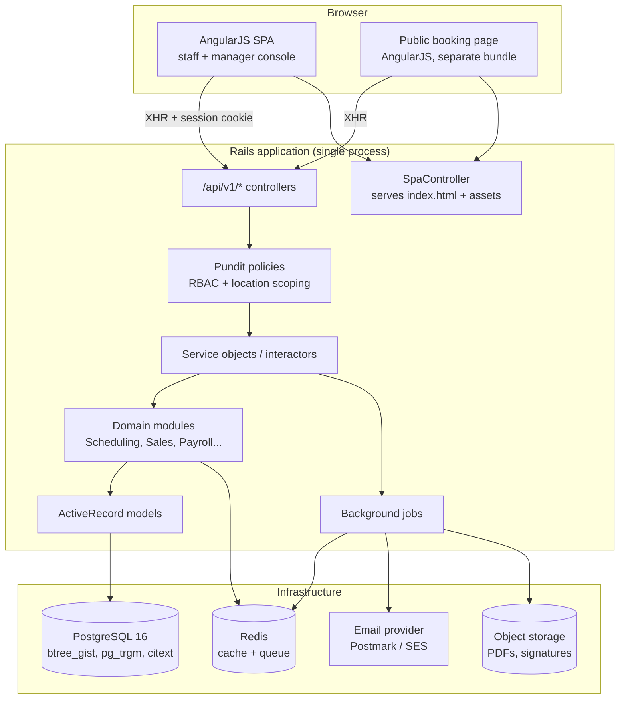
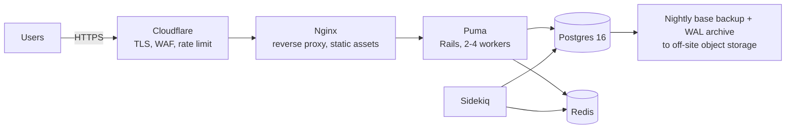

# System Architecture

**Version:** 1.0 · Rails API + AngularJS SPA, single project, single Postgres

---

## 1. Architectural Style

**A modular monolith.** One Rails application, one database, internal module boundaries enforced by
convention and namespacing.

**Why not microservices.** 2–10 locations, one company, one team. The dominant operation — the
availability search — needs shifts, appointments, rooms, staff, qualifications and time-off in a
single consistent read. Splitting those across services would require distributed transactions or
eventual consistency to protect the one invariant the business cannot tolerate breaking
(double-booking). A monolith with Postgres exclusion constraints gets that invariant for free.
Revisit only if you become multi-tenant SaaS.



---

## 2. Serving the AngularJS Frontend from Rails

Per your decision: one project, Rails serves the JS.

### 2.1 Layout

```
app/
  controllers/
    spa_controller.rb            # serves the console shell
    public_booking_controller.rb # serves the customer booking shell
    api/v1/...                   # JSON only, no views
  frontend/                      # AngularJS source (not app/assets)
    console/
      app.module.js
      core/            # http interceptor, auth, config, tz helpers
      shared/          # directives, filters, components
      features/
        calendar/      # day/week schedule board
        appointments/
        customers/
        staff/
        shifts/
        catalogue/
        sales/
        giftcards/
        payroll/
        reports/
    public/
      booking.module.js
```

### 2.2 Build

Use **Vite Ruby** (`vite_rails`) rather than Sprockets. It handles ES modules, hashed filenames,
HMR in development, and separate entry points for the console and public bundles. AngularJS 1.8.x
works fine as an npm dependency under Vite.

```ruby
# config/routes.rb
root 'public_booking#show'
get '/book(/*path)', to: 'public_booking#show'
get '/app(/*path)',  to: 'spa#show', as: :console   # catch-all for Angular routing

namespace :api do
  namespace :v1 do
    # ... see 05-api-design.md
  end
end
```

Both controllers render a minimal ERB layout with `vite_javascript_tag`. The catch-all `*path` is
what lets AngularJS's `$routeProvider`/`ui-router` own client-side navigation while deep links
still work on refresh.

### 2.3 Two bundles, not one

Keep the customer-facing booking app in a **separate bundle with no shared authenticated code**.
Reasons: it loads faster for the public, and it makes it structurally impossible for a bug to leak
staff-only UI or data models to anonymous visitors.

### 2.4 AngularJS-specific guidance

AngularJS 1.x is end-of-life upstream. That is an acceptable, deliberate choice for an internal
tool, but architect so that a future migration is not a rewrite:

- Keep **all business logic in Rails**, none in Angular services. The client should be a thin view
  over the API.
- Use **`.component()`**, not `.directive()` with scopes, and one-way bindings (`<`) throughout.
- No `$scope` soup — `controllerAs` + `vm` everywhere.
- Isolate all HTTP access behind a per-resource service (`AppointmentApi`, `ShiftApi`) so a swap of
  the view layer touches only components.
- A single `$http` interceptor handles CSRF token attachment, 401 → login redirect, 409 → conflict
  event, and 422 → form error mapping.

---

## 3. Backend Module Structure

```
app/
  models/                        # thin ActiveRecord: associations, validations, scopes
  policies/                      # Pundit: one per resource
  services/
    scheduling/
      availability_search.rb     # doc 03 §2
      book_appointment.rb
      reschedule_appointment.rb
      cancel_appointment.rb
      transition_status.rb
      slot_assignment/least_fragmentation.rb
    workforce/
      onboard_staff.rb
      offboard_staff.rb
      approve_availability.rb
      materialize_patterns.rb
      publish_schedule.rb
    catalogue/
      resolve_price.rb           # location override -> base, effective-dated
    sales/
      open_order.rb
      add_line_item.rb
      record_payment.rb
      void_payment.rb
      settle_order.rb
    gift_cards/
      issue_card.rb
      redeem_card.rb
      refund_card.rb
      reconcile_balances.rb
    payroll/
      generate_timesheets.rb
      apply_adjustment.rb
      generate_pay_statements.rb
      lock_pay_period.rb
    crm/
      merge_customers.rb
      record_soap_note.rb
      submit_intake_form.rb
    reporting/
      revenue_report.rb
      utilization_report.rb
      retention_report.rb
      salary_report.rb
  queries/                       # read-side objects for reports & lists
  serializers/                   # JSON shaping (Alba or Blueprinter)
  jobs/
```

**Conventions:**

- Controllers are thin: authorise → call one service object → serialise. No business logic.
- Every service object exposes `#call` and returns a Result (`Success`/`Failure` with an error code).
- Models never call other modules' models across a boundary; they go through service objects.
- All multi-table writes run inside an explicit `transaction do`.

---

## 4. Authentication & Authorisation

### 4.1 Authentication — session cookies, not JWT

Because the SPA is **same-origin** with the API, use Rails **httpOnly session cookies**:

```ruby
# config/initializers/session_store.rb
Rails.application.config.session_store :cookie_store,
  key: '_salon_session',
  httponly: true,
  secure: Rails.env.production?,
  same_site: :lax,
  expire_after: 12.hours
```

Rationale: JWT in `localStorage` is XSS-exfiltratable and gives no server-side revocation. With
httpOnly cookies plus `protect_from_forgery with: :exception` and a CSRF token surfaced to Angular
via a meta tag, you get revocable sessions and XSS-resistant token storage for free. There is no
mobile app or third-party API consumer here that would justify bearer tokens.

- Password hashing: bcrypt via `has_secure_password`.
- Session timeout: 12 hours, sliding; **front desk terminals get 30 minutes idle timeout** since
  they sit in public-facing areas.
- Failed-login lockout after 10 attempts.
- **Two-factor (TOTP) required for Owner and Manager roles** — these accounts can see rates,
  payroll and health data.
- Customer portal sessions are separate (different cookie key, different scope).

### 4.2 Authorisation — Pundit, two dimensions

Every request is checked on **role** and **location scope**:

```ruby
class AppointmentPolicy < ApplicationPolicy
  def index?  = user.owner? || user.manager? || user.front_desk? || user.therapist?
  def create? = user.owner? || user.manager? || user.front_desk?

  class Scope < Scope
    def resolve
      case user.role
      when 'owner'                 then scope.all
      when 'manager', 'front_desk' then scope.where(location_id: user.location_ids)
      when 'therapist'             then scope.where(staff_profile_id: user.staff_profile_id)
      else scope.none
      end
    end
  end
end
```

**Permission matrix (abbreviated):**

| Capability | Owner | Manager | Front Desk | Therapist |
|---|:--:|:--:|:--:|:--:|
| View schedule (own locations) | ✓ all | ✓ | ✓ | own only |
| Book / reschedule / cancel | ✓ | ✓ | ✓ | ✗ |
| Check in / out, take payment | ✓ | ✓ | ✓ | ✗ |
| View customer profile & visit history | ✓ | ✓ | ✓ | own appts only |
| **View health intake / SOAP notes** | ✓ | ✓ | **✗** | own appts only |
| Write SOAP note | ✗ | ✗ | ✗ | ✓ own appts |
| Manage staff, onboarding/offboarding | ✓ | ✓ | ✗ | ✗ |
| **View / edit hourly rates** | ✓ | ✓ | **✗** | own rate, read-only |
| Approve availability, publish shifts | ✓ | ✓ | ✗ | ✗ |
| Submit availability / time off | ✗ | ✗ | ✗ | ✓ own |
| Manage service catalogue & prices | ✓ | ✓ own loc. prices | ✗ | ✗ |
| Sell gift card | ✓ | ✓ | ✓ | ✗ |
| **Adjust gift card balance / void payment** | ✓ | ✓ | **✗** | ✗ |
| Run revenue & utilisation reports | ✓ | ✓ own loc. | ✗ | ✗ |
| **Run salary reports** | ✓ | ✓ own loc. | **✗** | own only |
| Lock pay period | ✓ | ✗ | ✗ | ✗ |
| Retroactive rate change | ✓ | ✗ | ✗ | ✗ |

`verify_authorized` and `verify_policy_scoped` as `after_action` on every API controller, so a
forgotten check fails loudly in tests rather than silently leaking data.

---

## 5. Protecting Health Information

Intake forms and SOAP notes are health data. A massage salon that does not bill insurance is
usually not a HIPAA covered entity, but state law and simple duty of care apply regardless — and
the reputational cost of a leak here is severe. Treat it as protected either way.

1. **Encryption at rest, column level.** Rails 7+ Active Record Encryption on
   `intake_answers.answer_value` and all four `soap_notes` text columns, non-deterministic (these
   are never searched). Keys held outside the database in Rails credentials / a secrets manager, so
   a database dump alone is not a breach.
2. **Access logging on read, not just write.** Every view of an intake form or SOAP note writes an
   `audit_logs` row. This is the only way to answer "who looked at this record."
3. **Front desk excluded entirely** at the policy layer *and* at the serialiser layer — health
   fields are never present in a payload a front-desk session can request.
4. **Therapists scoped to their own appointments.** A therapist cannot browse the customer base.
5. **No health data in logs.** Add these params to `config.filter_parameters`. Verify with a
   log-scanning test.
6. **No health data in email.** Reminders reference the appointment, never the condition.
7. **TLS everywhere**, HSTS, `force_ssl = true`.

---

## 6. Background Jobs

**Sidekiq + Redis** (or Solid Queue on Postgres if you prefer to drop the Redis dependency —
acceptable at this scale, and one fewer service to operate).

| Job | Schedule | Purpose |
|---|---|---|
| `MaterializeShiftPatternsJob` | nightly 02:00 | Extend recurring patterns to the 8-week horizon (BR-05) |
| `SendAppointmentRemindersJob` | every 15 min | Email reminders ~24h ahead, evaluated in each location's tz |
| `SweepExpiredSlotHoldsJob` | every minute | Delete expired holds |
| `MarkNoShowsJob` | every 30 min | Flag `scheduled` appointments >30 min past start as `no_show` for manager review (proposes, never auto-commits) |
| `ExpireGiftCardsJob` | nightly | Move past-expiry cards to `expired`, write ledger row |
| `ReconcileGiftCardBalancesJob` | nightly | Assert ledger sum == cached balance; alert on drift (BR-18) |
| `GenerateTimesheetsJob` | 1st of month 03:00 | Build the prior period's timesheets |
| `RefreshReportingViewsJob` | nightly 04:00 | Refresh materialised views |
| `NightlyBackupVerifyJob` | nightly | Confirm the backup completed and is restorable |

**Idempotency:** every job must be safe to run twice. Reminders check `notifications.sent_at`;
materialisation upserts on `(pattern_id, date)`.

---

## 7. Reporting Architecture

No data warehouse. At this scale, Postgres does everything.

- **Operational lists** (today's schedule, open orders) → live queries with the indexes in doc 02.
- **Revenue, salary** → live aggregate queries with date-range filters. Fast enough on months of
  data for a 10-location business.
- **Utilisation and retention** → **materialised views** refreshed nightly, because they scan wide
  date ranges and are never needed to-the-second.

```sql
CREATE MATERIALIZED VIEW mv_daily_location_metrics AS
SELECT
  a.location_id,
  (a.starts_at AT TIME ZONE l.timezone)::date        AS business_date,
  COUNT(*) FILTER (WHERE a.status = 'completed')     AS completed_count,
  COUNT(*) FILTER (WHERE a.status = 'no_show')       AS no_show_count,
  COUNT(*) FILTER (WHERE a.status = 'late_cancelled') AS late_cancel_count,
  SUM(EXTRACT(EPOCH FROM (a.service_ends_at - a.starts_at))/60)
    FILTER (WHERE a.status = 'completed')            AS booked_minutes,
  SUM(a.price_cents) FILTER (WHERE a.status = 'completed') AS service_revenue_cents
FROM appointments a
JOIN locations l ON l.id = a.location_id
GROUP BY 1, 2;
```

**The one rule reporting must never break (BR-19):** service revenue comes from
`order_line_items WHERE purchasable_type = 'ServiceVariant'`. Gift card sales are a **liability**,
reported in a separate "outstanding gift card liability" figure computed from the ledger.
Never `SUM(orders.total_cents)` and call it revenue.

**Exports:** XLSX via `caxlsx`, PDF via `wicked_pdf`/Grover, generated in a background job and
delivered as a signed download link. Never generate a large export in the request cycle.

---

## 8. Deployment

Single cloud server + Postgres, per your decision.



| Concern | Choice |
|---|---|
| Server | 1 VM, 4 vCPU / 8 GB to start. Ample for 10 locations. |
| Orchestration | Docker Compose, or **Kamal** — designed for exactly this shape of deployment |
| Web | Nginx → Puma (2 workers × 5 threads) |
| Database | Postgres 16, `btree_gist` + `pg_trgm` + `citext` extensions |
| Queue | Sidekiq + Redis (or Solid Queue to drop Redis) |
| TLS | Let's Encrypt via Certbot, or Cloudflare origin cert |
| Backups | `pg_basebackup` nightly + continuous WAL archiving (WAL-G) off-site. **Restore drill quarterly** — an untested backup is not a backup. |
| Environments | `production`, `staging` (same shape, smaller), `development` (Docker Compose) |
| Monitoring | Uptime check on `/health`, error tracking (Sentry/AppSignal), Postgres slow-query log, disk alerts |
| Secrets | Rails encrypted credentials; encryption keys for PHI held separately from the DB host |
| CI | GitHub Actions: RuboCop, Brakeman, bundler-audit, RSpec, then Kamal deploy on green |

**Single-server risk, stated plainly.** One VM means a single point of failure. For a business
where the front desk cannot book if the system is down, mitigate with:

- Automated **daily printable schedule** emailed to each location as a paper fallback.
- A documented, rehearsed **restore-to-new-host** runbook with a target RTO of 2 hours.
- Snapshots of the whole VM in addition to database backups.

Moving to a managed Postgres (RDS/Cloud SQL) later is the highest-value single upgrade — it removes
the hardest part of disaster recovery.

---

## 9. Technology Summary

| Layer | Choice | Notes |
|---|---|---|
| Language / framework | Ruby 3.3, Rails 7.2+ | |
| Database | PostgreSQL 16 | exclusion constraints are non-negotiable |
| Frontend | AngularJS 1.8.x via Vite Ruby | two bundles: console + public |
| Auth | `has_secure_password` + cookie sessions + TOTP for privileged roles | |
| Authorisation | Pundit | role × location scope |
| Serialisation | Alba or Blueprinter | explicit field lists — never `to_json` on a model |
| Jobs | Sidekiq + Redis | or Solid Queue |
| Encryption | Active Record Encryption | PHI columns |
| Audit | `audit_logs` table, written by service objects | not a gem — reads must be logged too |
| Email | Postmark or SES via ActionMailer | transactional only |
| PDF / XLSX | Grover / caxlsx | background generation |
| Testing | RSpec, FactoryBot, `database_cleaner` with real transactions for concurrency specs | |
| Static analysis | RuboCop, Brakeman, bundler-audit | in CI |

---

## 10. Architecture Decision Records (summary)

| # | Decision | Rationale | Alternative rejected |
|---|---|---|---|
| ADR-01 | Modular monolith | One team, one company, strong-consistency invariant | Microservices — distributed transactions for double-booking |
| ADR-02 | Postgres exclusion constraints for booking conflicts | Correctness independent of application code | App-level locking — fails under true concurrency |
| ADR-03 | Compute availability on demand, never cache | Stale slot caches are the top bug class in salon systems | Precomputed slot table |
| ADR-04 | Cookie sessions, not JWT | Same-origin SPA; revocable; XSS-resistant | JWT in localStorage |
| ADR-05 | Effective-dated rates and prices | Historical payroll and reports must be reproducible | Mutable rate column |
| ADR-06 | Gift card balance from an append-only ledger | Auditability; liability tracking; reconcilable | Mutable balance column |
| ADR-07 | Money as integer cents | Eliminates rounding error | Decimal/float |
| ADR-08 | Record payments, do not process them | No PCI scope; matches actual cash/Zelle operation | Gateway integration in v1 |
| ADR-09 | Two frontend bundles | Public bundle cannot leak staff code or models | Single bundle with route guards |
| ADR-10 | PHI encrypted at column level with read-access logging | DB dump is not a breach; answers "who looked" | Whole-disk encryption only |
